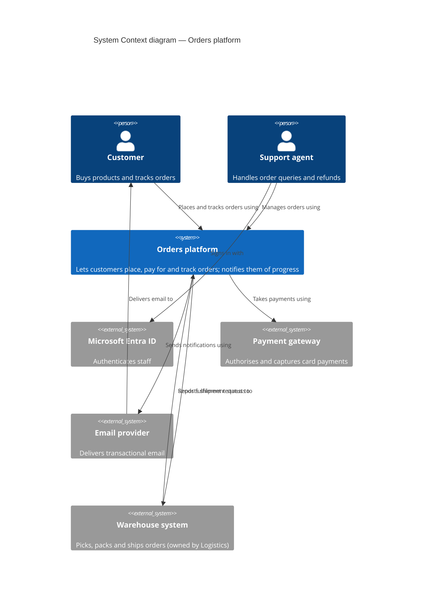
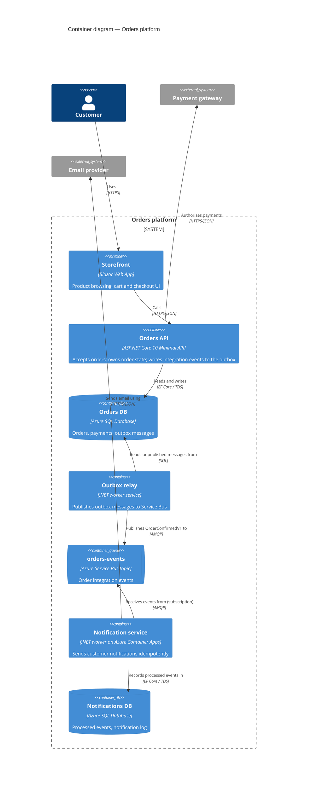

# Module 31 — ADRs and the C4 Model
*Phase 7: The Architect-Specific Track · Senior/Architect Interview Prep for .NET & C#*

> **State of practice verified on October 7, 2026.** The ideas in this module are stable — Michael Nygard's ADR format dates from 2011, Simon Brown's C4 model from 2006–2011 — but the *tooling* changed a lot in the last twelve months, and interviewers who use these tools will notice if your picture is out of date:
>
> - **Structurizr was consolidated.** The **Structurizr cloud service** went end-of-life: the shutdown was announced on **November 1, 2025**, new sign-ups stopped on **December 31, 2025**, workspaces went read-only during **2026**, and the service **shut down on September 30, 2026** — a week ago. On **January 2, 2026** Simon Brown announced **"Structurizr vNext"**, which folds the old products into one tool: **Structurizr Lite → `local`**, **on-premises installation → `server`**, **Structurizr CLI → `push` / `pull` / `export` / `validate` commands**. It runs from one Docker image (`structurizr/structurizr`), moved to an **open-core** model (everything free and open source, except that the *prebuilt* `server` binaries require a paid licence) and replaced Graphviz auto-layout with an improved Dagre implementation. If you used Structurizr before 2026, your mental model of its products is stale. The **Structurizr DSL** — the part that matters most — is unchanged in spirit.
> - **The Structurizr for .NET client library** was built to talk to the cloud service's API. With that service gone, treat the C#-based "model in code" approach as legacy and use the **DSL** (or another architecture-as-code tool) instead.
> - **The C4 model now has an O'Reilly book:** Simon Brown's ***The C4 Model: Visualizing Software Architecture*** (print edition July 2026; also on Leanpub). The website **c4model.com** remains the free reference, licensed CC BY 4.0. Its guidance is explicit that the **system context and container diagrams are sufficient for most teams**; component and code diagrams are optional.
> - **Mermaid's C4 support is still marked experimental** (syntax may change; no automatic layout; limited styling). Fine for a quick diagram in a GitHub or Azure DevOps Markdown file; not a modelling tool.
> - **LikeC4** (MIT licence) has become the most visible newer architecture-as-code alternative: a C4-inspired DSL with configurable element kinds, a VS Code extension, a live preview and an MCP server.
> - **MADR 4.0.0** (September 2024) is the current version of the most popular structured ADR template. It adds YAML front matter (`status`, `date`, `decision-makers`, `consulted`, `informed`) and "minimal" and "bare" variants.
> - **Government and cloud-vendor ADR guidance converged:** the **UK government published an ADR framework** on November 4, 2025 (mandatory only for decisions escalated to its cross-government Technical Design Council); the **Azure Well-Architected Framework** treats the ADR log as **append-only** and asks you to record the **confidence level** of each decision; **AWS Prescriptive Guidance** describes a Proposed → Accepted/Rejected → Superseded process, and a March 2025 AWS Architecture Blog post distils lessons from 200+ ADRs (short "readout" meetings, fewer than 10 participants); **Google Cloud's Architecture Center** has its own ADR page. **Martin Fowler** added an *ArchitectureDecisionRecord* bliki entry in **March 2026**. Thoughtworks has had *Lightweight ADRs* in **Adopt** since 2018.
> - **.NET architecture testing (decisions as executable rules):** **ArchUnitNET 0.13.4** (August 2026) ships xUnit v3 and MSTest v4 integrations; the original **NetArchTest.Rules** is unmaintained, and the actively maintained fork is **NetArchTest.eNhancedEdition** (1.4.5). The **`adr` .NET global tool** from endjin (`dotnet tool install -g adr`) is stable at 1.1.8.
>
> Tooling facts are "verified on this date"; the principles are stable.

## Orientation

Here is the sentence to carry through the whole module: **architecture knowledge has two halves — the *structure* of the system and the *reasons* it has that structure — and both evaporate unless they are written down in a form that is cheap to produce, easy to find, hard to misread and kept next to the code; C4 diagrams are the lightweight form of the first half, ADRs the lightweight form of the second.**

The curriculum entry for this module says it plainly: *documenting decisions so they survive personnel changes.* That is the test for everything below. When the person who made a decision leaves, can the next person tell **what** the system is, **why** it is that way, and **whether the reasons still hold**?

How this connects to earlier modules:

- **Module 30** taught the design document — a *temporary* argument written before a decision. This module teaches the *durable* residue: the ADRs a design doc produces, and the diagrams that describe the system as it stands.
- **Modules 20–22** (layering, modular monolith vs microservices, DDD) gave you the structural decisions — boundaries, modules, bounded contexts — that C4 container and component diagrams show and that architecture tests can enforce.
- **Modules 26–29** (compute, messaging and data platform, observability, security) are the source of the most common ADRs on Azure: *Container Apps over AKS*, *Service Bus over Event Hubs*, *OpenTelemetry with Azure Monitor*, *managed identity only*.
- **Module 29**'s threat models used data flow diagrams; this module shows how they relate to C4 container diagrams.
- **Module 32** (brownfield) leans on this module's "as-is / to-be / transition" diagrams and on backfilling ADRs for systems nobody documented.

Why it matters in interviews:

1. **Architect loops ask about it directly.** *"How do you document architecture?"*, *"How do you make sure decisions survive team changes?"*, *"Have you used ADRs? What went wrong?"*, *"Walk me through how you'd introduce ADRs to an organization that has none."*
2. **System design rounds test it implicitly.** A candidate who draws a clean context diagram, then a container diagram with labelled, technology-annotated arrows, then zooms into one container, *looks* like an architect before saying anything clever. A candidate who draws twelve unlabelled boxes with vendor icons looks like someone who has never had to explain a system to anyone.
3. **Past-design presentations (Module 30, Concept 42) are judged on exactly these artifacts:** one good diagram at the right altitude, and decisions narrated as *context → options → decision → consequences*.
4. **Senior candidates are expected to have opinions about documentation failure modes** — wikis that rot, diagrams nobody trusts, ADR processes that became bureaucracy — and about how to avoid them.

This module has six jobs:

1. **Build a first-principles model** of why architectural knowledge is lost and what it costs.
2. **Teach ADRs thoroughly** — what they are, which decisions deserve one, every section, the main templates, the lifecycle, writing quality, process, storage, tooling, and how to turn a decision into an *executable* rule in .NET.
3. **Teach the C4 model thoroughly** — the abstractions, each diagram level, the supporting diagrams, notation, the awkward cases (message brokers, microservices, modular monoliths), modelling versus diagramming, and Structurizr DSL hands-on.
4. **Show how to keep both alive** — docs-as-code, CI, review, ownership, drift.
5. **Place them among other approaches** — UML, 4+1, arc42, ISO 42010, ArchiMate, DFDs.
6. **Prepare you to use them under interview conditions** — on a whiteboard, in a past-design presentation, and when asked how you'd introduce them.

Seven framings to carry through:

1. **Code shows *how*; diagrams show *what*; ADRs show *why*.** No single artifact can carry all three, and code can never carry the rejected alternatives.
2. **Document what is expensive to rediscover and slow to change.** Everything else is cheaper to read from code or ask about.
3. **One decision, one short record, never edited — superseded.** Immutability is what makes an ADR log trustworthy history rather than a wiki page.
4. **Abstractions first, notation second.** C4 works because it fixes the *vocabulary* (system, container, component) before anyone argues about shapes and colours.
5. **Diagrams are maps, and maps have a zoom level.** Each diagram answers one question for one audience at one level of detail.
6. **A model beats a drawing.** Define each element once and generate many views; renaming a container should not mean editing nine PNGs.
7. **The best documentation is enforced or regenerated.** A decision checked by an architecture test, and a diagram rendered from a model in CI, are the two forms that resist rot.

| # | Concept | The one-line takeaway |
|---|---|---|
| 1 | How architectural knowledge evaporates | Rationale is tacit, leaves with people, and code cannot hold it |
| 2 | What, why and how — and their carriers | Diagrams carry structure, ADRs carry rationale, code carries mechanism |
| 3 | What counts as "architecture" | Decisions that are costly to change — significance measured by cost of change |
| 4 | The economics of architecture documentation | Document what is expensive to rediscover; the "new joiner" and "bus" tests |
| 5 | What an ADR is | One significant decision, its context and consequences, short, numbered, immutable, in the repo |
| 6 | Which decisions deserve an ADR | Cost of reversal, blast radius, cross-team, surprising, contested, constraining |
| 7 | The anatomy of a Nygard ADR | Title, status, context (forces), decision ("We will…"), consequences (good and bad) |
| 8 | Richer templates | MADR 4, Y-statements, cloud and government variants — and how to choose |
| 9 | Lifecycle, status and immutability | Proposed → Accepted/Rejected → Deprecated/Superseded; supersede, don't edit |
| 10 | Writing a good ADR | Value-neutral context, real options, honest consequences, confidence, revisit triggers |
| 11 | When to write: timing in the workflow | Proposed in a PR before deciding, or recorded after; design docs produce ADRs |
| 12 | Decision rights and the ADR process | Owners, reviewers, advice process, readout meetings, levels of decision |
| 13 | Storage, naming, discovery and tooling | `docs/adr/NNNN-title.md`, an index, links from code, adr-tools/MADR/log4brains/Structurizr |
| 14 | From record to guardrail | Fitness functions: architecture tests, analyzers, policies that enforce ADRs |
| 15 | ADRs at organizational scale | Principles, standards, org-level and team-level ADRs, deviations, health metrics |
| 16 | ADRs and AI in 2026 | ADRs as context and guardrails for coding agents; humans own the rationale |
| 17 | Why architecture diagrams fail | Ambiguous notation, mixed abstraction levels, no legend, vendor-icon soup |
| 18 | The C4 abstractions | Person, software system, container (not Docker), component, code |
| 19 | Level 1 — system context | The system as one box, its users and neighbours; for everyone |
| 20 | Level 2 — containers | Deployable/runnable units and data stores, with technology and protocol |
| 21 | Level 3 — components | Inside one container; worth it for modular monoliths and complex services |
| 22 | Level 4 — code | Usually generated or skipped |
| 23 | Supporting diagrams | System landscape, dynamic, deployment |
| 24 | Notation and the review checklist | Titles, legends, types, technologies, labelled one-way arrows |
| 25 | Modelling the hard cases | Brokers, microservices, modules, shared libraries, gateways, SaaS, Kubernetes |
| 26 | Diagramming vs modelling — the tools | Structurizr, C4-PlantUML, Mermaid, LikeC4, IcePanel, whiteboards |
| 27 | Structurizr DSL, hands-on | Model, views, styles, ADRs and docs in one versioned workspace |
| 28 | Keeping diagrams honest | Docs-as-code, CI rendering, PR review, ownership, drift detection |
| 29 | C4 among other approaches | UML, 4+1, arc42, ISO 42010, ArchiMate, DFDs, Azure icon diagrams |
| 30 | A lightweight architecture documentation set | ADRs + C4 + an arc42-lite README, and who maintains what |
| 31 | Brownfield: recovering decisions and structure | Decision archaeology, retroactive ADRs, as-is/to-be/transition diagrams |
| 32 | ADRs and C4 in the interview | Whiteboard C4, ADR-shaped answers, introducing ADRs to an organization |

---
# Part A — First principles: why architecture knowledge evaporates

## Concept 1 — How architectural knowledge evaporates

Every system you have worked on contains decisions nobody can explain any more. *Why is there a second database? Why does this service poll instead of subscribing? Why are we on this message broker when the rest of the company uses another one?* Somebody knew, once.

Software-architecture researchers have a name for this: **architectural knowledge vaporization** (Jansen and Bosch, mid-2000s). Their argument, which became the foundation of the "decisions as first-class citizens" movement, is that architecture is not just a set of boxes; it is **the set of decisions that produced those boxes**, and those decisions — with their context, alternatives and reasons — are exactly the part that is *never written down by default*. The structure survives in the code; the reasoning evaporates.

Why it evaporates — five mechanisms:

| Mechanism | What happens | Example |
|---|---|---|
| **Tacit knowledge** | The reasons live in people's heads and in meetings, chats and whiteboards that are never archived | "We picked Service Bus in a call with the Payments lead in 2023" |
| **Personnel change** | The people who knew leave, change teams or forget | The architect who chose the tenancy model left; the new team can't tell if it was deliberate |
| **Context drift** | The constraints that justified a decision change silently | "Must run on-premises" was true in 2022; the company is now cloud-only |
| **Scattered artifacts** | What *was* written is in a slide deck, an email thread, a closed Jira ticket and a wiki page with three versions | The design doc exists but nobody can find it |
| **Rationale isn't in code** | Code shows the chosen option, never the rejected ones, never the constraints, never the intent | The code uses polling; it can't say "we tried webhooks and the partner's endpoint was unreliable" |

**The cost.** Michael Nygard's 2011 post that introduced ADRs states the dilemma exactly: a new person facing an unexplained decision has two choices, both bad. They can **blindly accept it** — and keep a decision whose reasons no longer apply, perhaps for years — or **blindly change it** — and break the thing the decision was protecting, often rediscovering the original reason as an incident. This is G. K. Chesterton's fence in software: *don't remove a fence until you know why it was put up* — but if nobody can tell you why, you can't follow that advice either.

**The older insight.** Parnas and Clements, in *"A Rational Design Process: How and Why to Fake It"* (1986), argued that although nobody designs software in a perfectly rational order, the *documentation* should be written as if they had — including, for each design decision, the alternatives considered and why each was rejected — because that is what future maintainers need. ADRs are the lightweight, incremental, version-controlled descendant of that idea.

**Why "survive personnel changes" is the right test.** Knowledge loss is invisible while the people who hold it are present. A team can feel well-documented right up to the day its architect resigns. The question to ask of any documentation practice is therefore not "do we understand our system?" but **"would someone joining next month understand it — and could they tell which decisions are still safe to change?"**

**The interview-grade sentence:** *"Architectural knowledge vaporizes because the structure survives in code but the reasons don't: they're tacit, they leave with people, the constraints behind them drift, and whatever was written is scattered. The result is Nygard's dilemma — newcomers either blindly accept decisions whose reasons no longer hold or blindly reverse them and rediscover the reasons as incidents — so I judge any documentation practice by one test: would someone joining next month know what the system is, why it's that way, and which decisions are still safe to change?"*

---

## Concept 2 — What, why and how: three kinds of knowledge and their carriers

It helps to separate architecture knowledge into three kinds, because each has a natural carrier and none of the carriers can hold the others' content well.

| Kind | Question | Best carrier | Why that carrier |
|---|---|---|---|
| **Structure — the *what*** | What are the parts, who uses them, how do they connect, where do they run? | **Diagrams and models** (C4) | Structure is spatial and relational; a picture at the right zoom level conveys it in seconds. Code spreads it across repos, config and infrastructure |
| **Rationale — the *why*** | Why this structure? What else was considered? Under what constraints? With what known costs? | **Decision records** (ADRs) | Rationale is narrative and historical; it needs prose, dates and links. Code contains only the winning option |
| **Mechanism — the *how*** | How exactly does it work? | **Code and tests** | Code is the only artifact that is always current and executable. Prose that duplicates code goes stale fastest |

Then there are two adjacent kinds:

| Kind | Carrier |
|---|---|
| **Operations — how do we run and recover it?** | Runbooks, dashboards, alerts (Module 28) |
| **Intent and direction — where are we going?** | Strategy documents, roadmaps, principles, target-state diagrams (Modules 30, 32) |

**What code cannot tell you**, no matter how clean:

1. **The alternatives that were rejected**, and why.
2. **The constraints of the time** — budget, deadlines, team skills, regulatory scope, a vendor contract.
3. **The intent** — "this is temporary until the partner supports webhooks," "this boundary exists so Billing can be split out later."
4. **The cross-repository and runtime structure** — which services talk to which, over what, deployed where. A single repo shows one container's code; it doesn't show the system.
5. **The quality-attribute reasoning** — why the timeout is 2 seconds, why the cache TTL is 10 minutes, why this path is eventually consistent.
6. **What was deliberately *not* done** — non-goals and avoided technologies.

A useful consequence: **don't use ADRs or diagrams to describe mechanisms.** An ADR that explains *how* the outbox relay polls the table will be wrong after the next refactoring; an ADR that explains *why* we use an outbox at all will be right until we stop using one. Similarly, a component diagram that mirrors every class will drift weekly; one that shows four responsibilities will hold for a year.

**The interview-grade sentence:** *"I separate architecture knowledge into structure, rationale and mechanism, because each has a natural carrier: C4-style diagrams for what the parts are and how they connect, ADRs for why we chose this over the alternatives under the constraints of the time, and code and tests for exactly how it works. Code can never carry rejected alternatives, past constraints, intent or the runtime topology across repos — so those are exactly what I write down — and I keep mechanisms out of ADRs and diagrams, because that's the part that goes stale fastest."*

---

## Concept 3 — What counts as "architecture"

Before deciding what to document, you need a working definition of what is *architectural*. Three definitions are worth being able to quote, because they all point the same way:

1. **Grady Booch:** architecture represents the **significant design decisions** that shape a system, **where significance is measured by cost of change**.
2. **Ralph Johnson, via Martin Fowler's *"Who Needs an Architect?"* (2003):** architecture is **the decisions you wish you could get right early** — "the important stuff, whatever that is" — and, in a related formulation, the things that are **hard to change**.
3. **ISO/IEC/IEEE 42010:2022:** distinguishes the **architecture** (fundamental concepts or properties of an entity in its environment) from the **architecture description** (the work product that expresses it, organized into views addressing stakeholders' concerns). Diagrams and ADRs are parts of a *description*; the architecture exists whether or not you describe it.

Together they give you the operational rule this module uses: **a decision is architectural if reversing it would be expensive** — in time, money, risk, coordination or data migration — **or if it constrains many later decisions.**

**Architecturally significant requirements (ASRs).** The requirements that *drive* such decisions are a small subset of all requirements: typically quality attributes (latency, availability, data residency, security, multi-tenancy) and hard constraints, rather than features. Michael Keeling's *Design It!* and the SEI literature use the term ASR; Module 30's quality-attribute scenarios are how you write them. Every ADR's *context* section should be traceable to one or more ASRs.

**Typical architecturally significant decision categories** (AWS Prescriptive Guidance groups them similarly — structure, non-functional characteristics, dependencies, interfaces and construction techniques):

| Category | Examples on .NET/Azure |
|---|---|
| **Structure and decomposition** | Modular monolith vs microservices; module boundaries; bounded contexts (Modules 21–22) |
| **Data** | Storage engine per context; tenancy model; partition keys; event sourcing (Modules 12, 24, 27) |
| **Integration and communication** | Sync HTTP vs messaging; outbox; Service Bus vs Event Hubs vs Event Grid (Modules 11, 27) |
| **Platform and compute** | App Service vs Container Apps vs AKS vs Functions (Module 26) |
| **Quality attributes** | Consistency level per operation; retry and timeout policies; caching strategy (Modules 7, 10, 25) |
| **Security and identity** | Managed identity only; token flows; tenant isolation (Module 29) |
| **Interfaces and contracts** | Public API style and versioning; event schema evolution rules |
| **Construction techniques** | Clean Architecture layering; CQRS; MediatR or not; source generators; testing strategy (Modules 20, 23) |
| **Cross-cutting tooling** | OpenTelemetry + Azure Monitor; feature-flag system; CI/CD and deployment model (Module 28) |

**Not architectural** (normally): choice of a JSON library inside one service, a refactoring, naming, a minor version bump, a UI layout — unless one of them crosses a boundary or becomes expensive to reverse.

**The interview-grade sentence:** *"I use Booch's definition — architecture is the significant design decisions, with significance measured by the cost of change — together with 42010's distinction between the architecture itself and its description. So a decision is architectural if reversing it would be expensive in time, money, risk, coordination or data migration, or if it constrains many later decisions: decomposition, data and tenancy, integration style, platform, quality-attribute trade-offs, identity, public contracts and construction techniques. Those decisions are driven by a small set of architecturally significant requirements, and each ADR's context should trace back to them."*

---

## Concept 4 — The economics of architecture documentation

Documentation is not free, and engineers are right to resist documentation that costs more than it returns. A senior position is neither "document everything" nor "the code is the documentation" — it is an explicit cost/benefit judgment.

**The costs:**

| Cost | Notes |
|---|---|
| **Writing** | Minutes to hours for an ADR; an hour or two for a first C4 model |
| **Maintaining** | The recurring cost. Prose that duplicates code has the highest maintenance cost; rationale and high-level structure the lowest |
| **Being wrong** | Stale documentation is *worse* than none: it misleads confidently. A diagram nobody trusts is pure cost |
| **Finding** | Documentation that can't be found has the costs and none of the benefits |

**The benefits** are avoided costs: an incident not caused by a newcomer reversing a load-bearing decision; a week not spent rediscovering why; a debate not re-run every quarter; a faster onboarding; a design review that starts from shared vocabulary.

A rough mental model: **document an item when (cost of rediscovering it × likelihood someone needs it) exceeds (cost of writing it + cost of keeping it true).** That inequality explains the practical guidance:

| Worth documenting | Usually not worth documenting |
|---|---|
| Why a decision was made, with rejected options (high rediscovery cost, low maintenance cost — it never changes) | How a class works (read the code) |
| The system context and container structure (changes slowly, hard to see from code) | Every class and method (changes daily; generate it if needed) |
| Constraints and assumptions behind the design | Step-by-step instructions that duplicate scripts — automate them instead |
| Contracts other teams depend on | Meeting notes as such (extract the decisions) |
| Deviations from standards and their reasons | Anything already captured by a type system, test or schema |

**"Working software over comprehensive documentation."** The Agile Manifesto's line is often quoted as permission not to document. Its authors were explicit that they still value the right side of each statement; the point is *comprehensive* — big, upfront, speculative documentation. ADRs and C4 are popular precisely because they are the *opposite*: small, incremental, written when a decision happens, kept with the code.

**Two tests to calibrate "just enough":**

1. **The new-joiner test.** Could a competent engineer joining next month, with the repo and the docs but nobody to ask for a day, answer: *What does this system do, for whom? What are its deployable parts and how do they talk? What are the five decisions I must not casually reverse, and why?* If yes, you have enough. If they would need three meetings, you don't.
2. **The bus test** (the polite version of "bus factor"): if the person who knows most about the architecture were unavailable tomorrow, which decisions would become unexplained? Those need ADRs first.

Simon Brown's phrase for diagrams applies to both artifacts: aim for **"just enough" up-front design** — enough to communicate and to make the significant decisions consciously, not a big design up front.

**The interview-grade sentence:** *"I treat architecture documentation as an investment: document something when the cost of rediscovering it times the chance someone needs it outweighs the cost of writing it and keeping it true. That favours exactly what ADRs and high-level C4 diagrams capture — rationale, which never changes once recorded, and system structure, which changes slowly and is hard to see from code — and disfavours prose that duplicates code. I calibrate with a new-joiner test — could someone answer what the system is, how its parts talk, and which five decisions not to casually reverse, without three meetings? — and a bus test for which decisions would become unexplained if one person left."*

---
# Part B — Architecture Decision Records

## Concept 5 — What an ADR is

An **Architecture Decision Record (ADR)** is a short document that captures **one** architecturally significant decision: the **context** that made a decision necessary, the **decision** itself, and its **consequences** — together with its **status**. A project's collection of ADRs is its **decision log**.

The format was introduced by **Michael Nygard** in *"Documenting Architecture Decisions"* (Cognitect blog, November 15, 2011). The post was itself written as an ADR. Its prescriptions, still the core of every variant:

- **Small:** one or two pages. Nygard's analogy was a conversation with a future developer, not a specification.
- **One decision per record.**
- **Five parts:** *Title*, *Context*, *Decision*, *Status*, *Consequences*.
- **Numbered sequentially and monotonically;** numbers are never reused.
- **Stored in the project repository** (Nygard suggested `doc/arch/adr-NNN.md`), in a lightweight text format such as Markdown.
- **Kept when superseded:** an old decision isn't deleted; it's marked superseded and links to its replacement.

Fowler's 2026 bliki entry restates the same essentials — one decision, short, an *inverted pyramid* with the most important content first, monotonic numbering in the repository, never reopened once accepted but superseded instead, and an honest account of alternatives, consequences and **confidence**.

Five properties define an ADR and distinguish it from neighbouring artifacts:

1. **Atomic** — one decision.
2. **Contextual** — records the forces at the time, so a reader can judge whether they still hold.
3. **Honest about consequences** — positive *and* negative.
4. **Immutable once accepted** — history, not a living page.
5. **Co-located and versioned** — in the repo with the code it governs (or in a well-known central place for cross-cutting decisions).

**How an ADR differs from its neighbours:**

| Artifact | Purpose | Lifetime | Relationship to ADRs |
|---|---|---|---|
| **Design doc / RFC** (Module 30) | Argue for a proposal before deciding; reviewable in depth | Living during review, then frozen | A design doc **produces** one or more ADRs — the durable residue |
| **ADR** | Record one decision, its context and consequences | Permanent, append-only | — |
| **Decision log** | The ordered collection of ADRs (plus an index) | Permanent | The container |
| **Architecture principle** | A general rule guiding many decisions ("prefer managed services") | Years | Principles are *cited in* ADR contexts; adopting a principle can itself be an ADR |
| **Standard / guideline** | A mandated practice ("all services emit OpenTelemetry traces") | Until revised | Often the *consequence* of an org-level ADR |
| **Wiki page "Architecture"** | Describe the current state | Living — and often stale | Describes *what*; ADRs explain *why* |
| **Ticket / work item** | Track work | Until closed | Links to the ADR; never the only place a decision is recorded |
| **Meeting notes / chat thread** | Discussion | Forgotten | Raw material; the decision gets extracted into an ADR |

**Terminology you'll hear.** *Architecture* decision record and *architectural* decision record are used interchangeably. MADR's maintainers once expanded the acronym as "Markdown *Any* Decision Records" to stress that the format works for any decision; version 4 returned to "Markdown *Architectural* Decision Records" to keep the focus on architecture. Some organizations write "decision records" for non-architecture decisions too (process, tooling, team agreements) — sensible, but keep them in a separate log so the architecture log stays meaningful.

**The interview-grade sentence:** *"An ADR is Michael Nygard's 2011 format for recording one architecturally significant decision in one or two pages — title, status, the context and forces at the time, the decision stated as 'we will', and its positive and negative consequences — numbered, stored in the repository next to the code, and never edited once accepted, only superseded. It differs from a design doc, which argues a proposal before the decision and produces ADRs as its residue; from a principle, which guides many decisions; and from a wiki page, which describes the current state rather than why it is that way."*

---

## Concept 6 — Which decisions deserve an ADR

Writing too few ADRs leaves the important decisions unexplained; writing too many buries them and turns the practice into bureaucracy. A decision deserves an ADR when **at least one** of these is true:

| Test | Question | Example |
|---|---|---|
| **Cost of reversal** | Would undoing it take more than a few days, a data migration, a coordinated release or a contract change? | Choosing Cosmos DB's partition key; adopting event sourcing |
| **Blast radius** | Does it affect many components, teams, tenants or customers? | Adopting a shared authentication approach |
| **Cross-team** | Will other teams depend on it, or have to follow it? | Event schema versioning rules |
| **Surprise** | Would a competent newcomer be surprised by it, or be tempted to "fix" it? | Polling a partner API instead of using its webhooks |
| **Contested** | Was there real disagreement, or were several options credible? | Service Bus vs Event Hubs |
| **Constraining** | Does it constrain many future decisions? | "All inter-module calls go through public contracts" |
| **Deviation** | Does it deviate from an organizational standard, a reference architecture or common practice? | Self-hosting Redis despite the "managed services first" principle |
| **Risk acceptance** | Does it knowingly accept a risk or a cost? | Accepting single-region deployment for v1 |
| **Negative decision** | Did we decide *not* to do something people will keep proposing? | "We will not adopt MediatR" (Module 23); "We will not split Billing out this year" |

Spotify's 2020 engineering post *"When Should I Write an Architecture Decision Record"* offers a deliberately low bar — its flowchart's punch line is "almost always" — with three entry points: **backfilling** an undocumented existing practice, **concluding an RFC** for a large change, and **small decisions**, because enough small decisions compound into a future migration. That bar suits a culture that's under-documenting; a team already drowning in ADRs needs the table above instead.

**Usually not ADR-worthy** (and better recorded elsewhere):

| Decision | Better place |
|---|---|
| A library choice inside one component, easy to swap | The PR description |
| A coding convention | `.editorconfig`, analyzers, a contributing guide |
| A configuration value that will be tuned | Configuration with a comment, or the runbook |
| Purely operational procedure | A runbook |
| Product or prioritization decisions | Product docs or the roadmap — unless they constrain architecture |

**Granularity — one decision per ADR.** "Use an event-driven notification service with an outbox on Service Bus hosted in Container Apps" is four decisions with independent lifetimes: you might later move hosting to AKS while keeping the outbox. Split them, and let the design doc (Module 30) tie them together. A practical test: *could one part be superseded while the others remain valid?* If yes, separate ADRs.

**Stage decisions that unfold over time.** The Azure WAF guidance and Olaf Zimmermann both recommend splitting phased decisions — short-, mid- and long-term — into separate records rather than one ADR that tries to describe a roadmap.

**The interview-grade sentence:** *"I write an ADR when a decision is expensive to reverse, has a wide blast radius, crosses team boundaries, would surprise or tempt a newcomer to 'fix' it, was genuinely contested, constrains later decisions, deviates from a standard, knowingly accepts a risk — or is a deliberate 'no' that people will keep re-proposing. I keep one decision per record, using the test 'could one part be superseded while the rest stays valid?', and I leave library swaps inside a component, conventions and tunable settings to PR descriptions, analyzers and config."*

---

## Concept 7 — The anatomy of a Nygard ADR

Nygard's five sections are worth mastering before any richer template, because every template is an elaboration of them.

```markdown
# 31. Use a transactional outbox for integration events

Date: 2026-10-14

## Status

Accepted. Supersedes [7. Send order emails synchronously during checkout](0007-send-order-emails-synchronously.md).

## Context

<forces, stated neutrally>

## Decision

We will …

## Consequences

<what becomes easier, what becomes harder, what we must now do>
```

### Title

A short **noun phrase naming the decision** — readable in an index. Prefer the decision over the topic:

| Weak | Strong |
|---|---|
| "Messaging" | "Use Azure Service Bus for order integration events" |
| "Database discussion" | "Use one Azure SQL database per module with separate schemas" |
| "ADR about auth" | "Authenticate service-to-service calls with managed identity only" |

### Status

One of a small set: *Proposed*, *Accepted*, *Rejected*, *Deprecated*, *Superseded by ADR-NNNN* (Concept 9). The status line is the only part of an accepted ADR that normally changes.

### Context

The **forces at play** — technical, organizational, political, social, economic, regulatory — written so the reader can later ask *"is this still true?"*. Nygard's guidance: describe the forces **in value-neutral language**, stating facts and tensions, not advocacy.

Good context answers:

1. **What is the problem or question?** One or two sentences.
2. **What forces pull in different directions?** "Checkout must never fail because of notifications (G1); notifications must not be lost (G2); the team has no Kafka experience; budget under €1,000/month."
3. **What constraints apply?** Regulatory, platform standards, deadlines, existing systems.
4. **What evidence exists?** Incidents, measurements, spike results — linked, not pasted.
5. **What triggered the decision now?**

Bad context is a sales pitch ("Service Bus is the industry-leading enterprise broker"), a history essay, or a description of the solution.

### Decision

The response to the forces, stated in **active voice and full sentences: "We will …"**. Precise enough that a reader could tell whether a given piece of code complies.

> *We will write integration events to an `OutboxMessages` table in the same database transaction as the business change, and a relay will publish them to Azure Service Bus. Request handlers will not publish to Service Bus directly.*

Include **scope** ("for integration events leaving the Orders bounded context; domain events inside the module are unaffected") and the **one or two essential parameters** if they *are* the decision. Leave implementation detail to code.

### Consequences

**All** the consequences, not just the good ones — Nygard is explicit that positive, negative and neutral consequences all belong here, because the consequences of one decision become the *context* of later ones.

> **Positive:** No lost events between commit and publish (dual-write problem removed). Checkout no longer depends on broker availability.
> **Negative:** Events are delivered at least once; every consumer must be idempotent. One more table to purge and monitor. Publication latency gains the relay's polling interval (≤ 1 s at p95).
> **Neutral / follow-ups:** The relay needs an owner and an alert on outbox age. ADR-0032 (broker choice) and ADR-0033 (hosting) build on this.

Consequences are where most weak ADRs fail (Concept 10's "free lunch coupon" anti-pattern). If you can't list a negative consequence, you probably haven't understood the decision.

### What Nygard left out — and what most teams add

Nygard's minimal format deliberately omitted a few things that most teams now add, either in the body or as metadata:

| Addition | Why |
|---|---|
| **Considered options** with pros and cons | Without them, a reader can't tell whether the obvious alternative was evaluated — and will re-propose it |
| **Decision drivers** | The criteria, so the options can be compared on the same basis |
| **Deciders / consulted / informed** | Who made and who shaped the decision (Concept 12) |
| **Date** | Context is time-bound |
| **Confidence** | Azure WAF and Fowler both recommend it; a low-confidence decision invites earlier review |
| **Revisit triggers** | Conditions under which the decision should be reconsidered |
| **Confirmation / compliance** | How we will check the decision is followed (MADR 4; Concept 14) |
| **Links** | To the design doc, incidents, spikes, related ADRs |

**The interview-grade sentence:** *"A Nygard ADR has five parts: a title that names the decision rather than the topic; a status; a context that states the forces — technical, organizational, regulatory, economic — in value-neutral language so a later reader can check whether they still hold; a decision written in active voice as 'we will', precise enough to tell whether code complies; and consequences that include the negative and neutral ones, because they become the context of the next decision. Most teams now add considered options, decision drivers, deciders, date, confidence, revisit triggers and how compliance will be confirmed."*

---

## Concept 8 — Richer templates: MADR, Y-statements and the vendor variants

Many templates exist; Joel Parker Henderson's GitHub collection lists dozens. You need to know four families well enough to choose and to recognize them in an interview.

### 1. Nygard (minimal)
Title, Status, Context, Decision, Consequences. **Best for:** teams starting out; small decisions; low ceremony. **Risk:** alternatives get skipped.

### 2. MADR 4 — Markdown Architectural Decision Records
The most widely used *structured* template (maintained under the **adr.github.io** organization; version **4.0.0**, September 2024). Its full form:

```markdown
---
status: "accepted"            # proposed | rejected | accepted | deprecated | superseded by ADR-NNNN
date: 2026-10-14
decision-makers: [Principal engineer, Commerce]
consulted: [Payments team, SRE, Security]
informed: [Commerce engineering]
---

# Use Azure Service Bus for order integration events

## Context and Problem Statement
## Decision Drivers
## Considered Options
## Decision Outcome
### Consequences
### Confirmation
## Pros and Cons of the Options
## More Information
```

Things MADR gets right:

- **Front matter** makes status, date and people machine-readable — easy to index, lint and render (the default front matter works with the *Just the Docs* Jekyll theme).
- **Decision drivers** before options — criteria first, so the comparison isn't rigged.
- **"Chosen option: X, because …"** — the outcome is tied to the drivers.
- **Confirmation** — how compliance will be verified (a review, an architecture test, a fitness function).
- **Pros and cons per option** — the steelmanned alternatives live here.
- **Four variants:** full, minimal (mandatory sections only), and "bare" versions of each without the explanatory text.

**Best for:** contested decisions, decisions other teams will read, organizations that want consistency.

### 3. Y-statements (Olaf Zimmermann)
One long sentence with six parts — shaped like the letter *Y* ("why"):

> **In the context of** order notifications leaving the Orders context,
> **facing** the need to never lose a notification nor fail checkout when the provider is down,
> **we decided for** a transactional outbox relayed to Azure Service Bus
> **and neglected** publishing directly after commit and in-process background queues,
> **to achieve** at-least-once delivery with checkout isolated from broker and provider failures,
> **accepting that** consumers must be idempotent and an outbox table must be operated.

**Best for:** decision summaries in an index, a design doc, an interview answer, or a quick ADR for a small decision. It forces the four things a reader needs most: context, the driver, the rejected options and the accepted cost. Zimmermann also describes a longer variant that adds "because" (rationale) — useful when the driver isn't self-explanatory.

### 4. Organizational and vendor variants

| Source | Distinctive features |
|---|---|
| **Azure Well-Architected Framework (ADR page)** | Append-only log; record **confidence level**; problem, options, outcome with trade-offs; keep records pithy and assertive; split phased decisions; backfill for brownfield workloads |
| **AWS Prescriptive Guidance** | Owner per ADR; Proposed → review meeting → Accepted/Rejected; accepted and rejected ADRs immutable; supersede by new ADR; **use ADRs in code review** to check conformance |
| **Google Cloud Architecture Center** | Includes requirements and **affected critical user journeys**; store close to code, optionally mirror key decisions in a wiki |
| **UK government ADR framework (Nov 2025)** | Title, date, status, context, decision, consequences, **stakeholders consulted**, links to supporting documents; four decision levels from team to cross-government |
| **Tyree & Akerman (IEEE Software, 2005)** | The heavyweight ancestor: issue, decision, status, group, assumptions, constraints, positions, argument, implications, related decisions/requirements/artifacts/principles, notes. Too heavy for most teams; a good checklist for high-stakes decisions |
| **Microsoft ISE playbook — decision log** | A decision log table plus ADRs in the repo; a trade-study template for the comparison |

### How to choose

| Situation | Template |
|---|---|
| Team new to ADRs; mostly small decisions | Nygard + an optional "Options considered" section |
| Organization-wide practice; cross-team readers | MADR 4 (full for contested decisions, minimal for the rest) |
| Index entries, design-doc summaries, interview answers | Y-statements |
| Regulated or very high-stakes decisions | MADR full + Tyree–Akerman's assumptions/constraints/related-artifacts fields |
| Azure workload reviewed against WAF | Any of the above **plus a confidence field** |

**The rule that matters more than the template:** pick one, put it in `docs/adr/0000-template.md`, and use it consistently. A team that argues about templates for a month has missed the point.

**The interview-grade sentence:** *"I know four template families: Nygard's minimal five sections; MADR 4, which adds machine-readable front matter for status, date, decision-makers, consulted and informed, decision drivers before options, per-option pros and cons and a confirmation section on how compliance is checked; Zimmermann's Y-statements — in the context of, facing, we decided for, and neglected, to achieve, accepting that — which fit a summary or an interview answer; and the cloud and government variants, which add confidence level, critical user journeys and stakeholders consulted. I'd usually standardize on MADR, full for contested decisions and minimal for the rest, and add a confidence field — but consistency matters more than the template."*

---

## Concept 9 — Lifecycle, status and immutability

An ADR log is valuable because it is **history**: you can read it in order and see how the architecture's reasoning evolved. That only works if records are not quietly rewritten.

**Statuses and transitions:**

```text
            ┌──────────────► Rejected   (kept, with the reason)
            │
 Proposed ──┤
            │
            └──────────────► Accepted ───► Deprecated              (no longer applies; nothing replaces it)
                                  │
                                  └──────► Superseded by ADR-NNNN  (replaced; links both ways)
```

| Status | Meaning | Notes |
|---|---|---|
| **Proposed** | Under discussion | Typically an open PR (Concept 11). Should have a decision date |
| **Accepted** | In force | Immutable from here, except the status line and links |
| **Rejected** | Considered and declined | **Keep it.** A rejected ADR answers "did anyone consider X?" forever |
| **Deprecated** | No longer applies, nothing replaces it | E.g., the component it governed was retired |
| **Superseded by ADR-NNNN** | Replaced by a newer decision | The new ADR says "Supersedes ADR-MMMM"; both link |

Some teams add *Draft* (not ready for review) or *Amended by* (Concept below); keep the set small.

**Immutability rules** (Azure WAF, AWS, Fowler and Nygard all agree on the core):

1. **Never edit the substance of an accepted ADR.** If the decision changes, write a new ADR that supersedes it. If you edit the old one, you destroy the record of what was believed at the time — the very thing that lets a reader judge whether a past decision was reasonable.
2. **Allowed edits:** the status line; "superseded by" links; fixing typos and broken links; adding a dated *note* that doesn't change meaning ("2027-03: the referenced spike results moved to …"). Some teams allow a dated *Update* section for small factual clarifications; be strict about what counts.
3. **Never delete an ADR.** Not even a rejected or superseded one. Numbers are never reused.
4. **Supersede, don't append forever.** If you find yourself adding the third "Update" to an ADR, the decision has changed: supersede it.

**Supersede vs amend vs deprecate:**

| Situation | Action |
|---|---|
| The decision is reversed or substantially changed | **New ADR** "Supersedes ADR-0007"; mark 0007 "Superseded by ADR-0031" |
| The decision stands but its scope narrows or extends (e.g., outbox now also used by Billing) | **New ADR** that *amends* the old one, or (for trivial scope changes) a dated note — be consistent |
| The thing the decision governed no longer exists | Mark **Deprecated** with a one-line reason and date |
| You realize the context described was wrong at the time | A new ADR that corrects and supersedes; history shows the error, which is itself useful |

**Partial supersession** is common: ADR-0045 may supersede *only the hosting part* of ADR-0033. Say exactly which part in both records — another reason to keep ADRs atomic.

**Revisit triggers and review dates.** Decisions with low confidence, or that depend on volatile context (prices, vendor roadmaps, team size), should carry explicit **revisit triggers** ("revisit if sustained volume exceeds 10,000 events/s") and optionally a **review date**. Zimmermann's definition of done (Concept 10) includes scheduling the review. A quarterly glance at ADRs whose triggers may have fired is cheap and catches context drift before an incident does.

**The interview-grade sentence:** *"ADRs move from Proposed to Accepted or Rejected, and later to Deprecated or Superseded by a named successor; rejected ones are kept, because they answer 'did anyone consider X?' forever. Once accepted, an ADR's substance is never edited and numbers are never reused — only the status line, links and typos change — because the value of the log is an honest history of what was believed at the time. A changed decision becomes a new ADR that supersedes the old one, linking both ways and saying exactly which part it replaces, and low-confidence decisions carry revisit triggers so context drift is caught deliberately."*

---

## Concept 10 — Writing a good ADR

A good ADR lets a reader who wasn't there **understand the decision, judge whether it was reasonable at the time, and tell whether it still holds.** That translates into concrete qualities:

| Quality | What it looks like | Failure it prevents |
|---|---|---|
| **Pithy** | One to two pages; inverted pyramid — decision and key reason first | Nobody reads it |
| **Value-neutral context** | Forces and facts, not advocacy | A sales pitch disguised as context |
| **Real options** | At least two genuine alternatives, steelmanned, including "do nothing" where relevant | Readers re-propose the obvious alternative |
| **Explicit drivers** | Criteria stated before the comparison | Criteria invented to fit the winner |
| **Honest consequences** | Negative and neutral consequences, follow-up obligations | Surprise costs; "free lunch" decisions |
| **Evidence linked** | Spikes, benchmarks, incidents, cost estimates — with dates | Unfalsifiable claims |
| **Confidence stated** | High / medium / low, and why | Low-confidence guesses treated as settled law |
| **Revisit triggers** | Conditions that would change the decision | Decisions outliving their context |
| **Precise decision** | Compliance is checkable | "We will prefer…" with no way to tell whether we did |
| **Journalistic tone** | Reports a decision and its reasons | A policy manual or a cookbook |

### Zimmermann's "Definition of Done" for a decision (ecADR)

Olaf Zimmermann proposes five criteria — **E-C-A-D-R** — before a decision counts as *done*:

1. **Evidence** — there is reason to believe the chosen design will work (a prototype, a spike, a trusted reference, a measurement).
2. **Criteria** — at least two alternatives were identified and compared against stakeholder concerns.
3. **Agreement** — at least one peer or mentor and the team have challenged the decision and agree with the outcome and rationale.
4. **Documentation** — it is captured and shared in a lean template (an ADR or a Y-statement).
5. **Realization and review** — implementation is scheduled, and a time to check that it was implemented as intended (and still holds) is set.

This is a useful checklist for reviewing an ADR PR: *E? C? A? D? R?*

### Anti-patterns (from Zimmermann's "How to create ADRs — and how not to")

| Anti-pattern | Symptom | Fix |
|---|---|---|
| **Fairy tale** | Shallow justification; only pros | Add cons for the chosen option and the reasons the alternatives lost |
| **Sales pitch** | Marketing adjectives, unsupported superlatives | Replace adjectives with evidence and numbers |
| **Free lunch coupon** | No consequences, or only harmless ones | List what becomes harder and who pays |
| **Dummy alternative** | Straw-man options to make the favourite look good | Steelman; include the option a senior reviewer would propose |
| **Sprint / rush** | Only short-term effects; a single option | Consider operations, maintenance, the 1-year view |
| **Tunnel vision** | Ignores other stakeholders — ops, security, finance | Walk the stakeholder list (Module 30, Concept 4) |
| **Maze** | Title and content don't match; the discussion wanders | One decision; title names it |
| **Blueprint / policy in disguise** | Reads like a cookbook or a mandate rather than a decision record | Report the decision and reasons; put procedures in guides |
| **Mega-ADR** | Many pages of architecture description crammed in | Move structure into C4/arc42; link from the ADR |
| **Novel / epic** | All the documentation of a system in one ADR, conversational tone | Split; keep it a record of one decision |

Two more seen frequently in practice:

| Anti-pattern | Symptom | Fix |
|---|---|---|
| **Retro-justification** | ADR written after the fact to legitimize a decision with invented "options" | Honestly label it as a retroactive record (Concept 31); state what was actually considered |
| **Rubber stamp** | ADRs nobody reviews; "Accepted" set by the author alone for cross-team decisions | Decision rights (Concept 12) |

### Expressing confidence

Confidence is a property of the decision, and it changes how readers should treat it:

| Level | Meaning | Implication |
|---|---|---|
| **High** | Strong evidence (load test, production data); well-understood trade-offs | Change only with new evidence |
| **Medium** | Reasonable evidence; some assumptions untested | Revisit if an assumption is falsified |
| **Low** | Decided under time pressure or with little evidence; reversible | Explicit revisit trigger or date; treat as provisional |

Recording "low confidence — chosen to unblock M1; revisit after the load test" is not weakness. It tells the next reader that challenging the decision is welcome — and stops a guess from hardening into dogma.

**The interview-grade sentence:** *"A good ADR lets someone who wasn't there understand the decision, judge whether it was reasonable at the time and tell whether it still holds: it's short and decision-first, states the forces neutrally, compares at least two real options against drivers stated up front, lists honest negative consequences and follow-up obligations, links its evidence, states its confidence and revisit triggers, and is precise enough to check compliance. I review ADR pull requests against Zimmermann's definition of done — evidence, criteria, agreement, documentation, and a realization-and-review date — and watch for his anti-patterns: the fairy tale, the sales pitch, the free-lunch coupon, the dummy alternative and the mega-ADR."*

---

## Concept 11 — When to write: timing in the workflow

There are two legitimate moments to write an ADR, and they suit different situations.

**1. Before the decision — the ADR *is* the proposal.** The author opens a pull request adding `docs/adr/0032-use-service-bus-for-order-events.md` with status **Proposed**. Review happens in PR comments (or a short readout meeting); merging with status **Accepted** *is* the decision. Advantages: lightweight, versioned, the discussion is attached to the record, and nobody can claim they weren't told. This is the dominant pattern for team- and cross-team-level decisions that don't need a full design doc.

**2. After the decision — the ADR *records* it.** A larger decision was argued in a design doc or RFC (Module 30); once it's approved, the author extracts the durable decisions into ADRs, linking back to the doc. Spotify's flow and Module 30's Concept 40 describe exactly this: *RFC concluded → write the ADR(s)*.

**How they fit together:**

| Decision size | Artifact flow |
|---|---|
| Small / two-way door | PR description; optionally a minimal ADR if it would surprise a newcomer |
| Medium, one team | **ADR-as-proposal** in a PR, reviewed by one or two peers |
| Medium, cross-team | **ADR-as-proposal** with named required reviewers from affected teams; maybe a 30-minute readout |
| Large / one-way door | **Design doc → review → several ADRs** extracted, each linking to the doc |
| Already made, undocumented | **Retroactive ADR** (Concept 31) |

**The last responsible moment.** Lean and agile practice says to make irreversible decisions at the *last responsible moment* — late enough to have information, early enough that not deciding doesn't itself cause damage. ADRs support this: a **Proposed** ADR can sit open with "decision due" and named open questions while a spike runs, making the pending decision visible instead of implicit.

**Decisions made in code review.** Many architectural decisions are actually made in a PR ("let's just call the provider directly here"). AWS's guidance is to use ADRs *during* code review — reviewers check changes against accepted ADRs, and a reviewer who sees an undocumented architectural decision being made asks for an ADR. A PR template checkbox helps (Appendix C).

**Writing ADRs in the same PR as the code.** For decisions whose consequence is a code change, put the ADR in the same PR as the first implementation (or the PR before it). The decision and the code that embodies it are reviewed together and are traceable through `git log`.

**The interview-grade sentence:** *"I write an ADR at one of two moments: before the decision, as a Proposed ADR in a pull request where the review happens and merging as Accepted is the decision — my default for medium decisions, with named reviewers when other teams are affected — or after a design doc is approved, extracting its durable decisions into ADRs that link back to it. Open Proposed ADRs make pending decisions visible while a spike runs, which supports deciding at the last responsible moment, and in code review I check changes against accepted ADRs and ask for an ADR when someone is quietly making an architectural decision in a PR."*

---

## Concept 12 — Decision rights and the ADR process

An ADR records *a* decision; it doesn't say *who* is allowed to make it. Without explicit decision rights, an ADR practice degenerates into either a free-for-all (anyone writes "Accepted") or a bottleneck (one architect must approve everything).

**Roles on an ADR** (MADR's front matter encodes most of these):

| Role | Responsibility |
|---|---|
| **Owner / author** | Drives the decision, writes the ADR, incorporates feedback, updates status (AWS: "ADR owner") |
| **Decision-maker(s)** | Accountable for the decision — ideally one named person or body (Module 30, Concept 33's DACI "Approver") |
| **Consulted** | Affected teams and experts whose input must be sought |
| **Informed** | People who need to know the outcome |

**Process models that work:**

1. **Team-level, PR-based.** The team owns its decisions; ADR PRs need one or two approvals from the team plus any affected team. Cheap and fast.
2. **The advice process** (Andrew Harmel-Law, *"Scaling the Practice of Architecture, Conversationally,"* martinfowler.com). **Anyone may make an architectural decision, provided they first seek advice from everyone meaningfully affected and from people with relevant expertise.** They don't need permission; they must listen. ADRs are the record — including the advice received and how it was treated — and an **architecture advisory forum** (a regular open meeting) is where significant ADRs are discussed. A small set of **architecture principles** and a **tech radar** give guidance. This model scales architecture decisions without a central bottleneck, and it is a strong answer when an interviewer asks how an architect enables teams rather than gatekeeping them.
3. **Readout meetings for contested ADRs** (AWS's experience from 200+ ADRs): 30–45 minutes; 10–15 minutes of silent reading; written comments on specific sections; fewer than 10 participants; outcome recorded in the ADR. Same pattern as Module 30's design review, scaled down.
4. **Levelled decisions.** The UK government framework names four levels — team, cross-team/programme, department, cross-government — with mandatory ADRs only at the top (Technical Design Council escalations). Most organizations have a similar implicit ladder: **team ADRs** in the service repo; **domain or platform ADRs** in a shared architecture repo; **organization-wide decisions** (standards, principles) owned by an architecture group.

**Rules of thumb:**

- **Decide at the lowest level that owns all the consequences.** A choice of JSON serializer inside one service is a team decision; event schema versioning rules for every team are an organization decision.
- **Make escalation explicit, not political.** "If a team ADR deviates from an org-level ADR, the deviation needs an org-level reviewer" is a clear rule.
- **Time-box Proposed.** An ADR open for months is a decision avoided. Give every Proposed ADR a decision date; if nobody objects with a reason by then, the owner may accept it (a *consent* rule, Module 30 Concept 33) for reversible decisions.
- **Record dissent.** "Consulted: Payments (preferred Event Hubs — see §Pros and Cons)" is honest and makes "disagree and commit" safe.

**Avoiding ADR bureaucracy.** Signs the process has become theater: ADRs written *after* the code merged simply to satisfy a checklist; architects approving ADRs they didn't read; teams avoiding ADRs to avoid review; "ADR count" used as a performance metric. Remedies: keep templates minimal for small decisions, let teams own team-level decisions, and use review effort proportional to reversibility.

**The interview-grade sentence:** *"Every ADR needs an owner who drives it, one accountable decision-maker, named consulted parties and an informed audience — MADR's front matter encodes exactly that. My default process is PR-based team ownership, with decisions taken at the lowest level that owns all the consequences, and for scaling across teams I like Harmel-Law's advice process: anyone can decide if they first seek advice from those affected and those with expertise, with ADRs recording the advice and an open advisory forum for the big ones. Contested ADRs get a short readout meeting — read silently, comment in writing, under ten people — Proposed ADRs get a decision date, and dissent is recorded so disagree-and-commit is safe."*

---

## Concept 13 — Storage, naming, discovery and tooling

An ADR nobody can find is an ADR that doesn't exist. Storage and tooling decisions are about **findability**, **reviewability** and **staying next to the code**.

### Where

| Option | Pros | Cons | Use when |
|---|---|---|---|
| **In the service repo** (`docs/adr/`) | Versioned with the code; reviewed in PRs; found by anyone reading the code; `git blame`-able | Cross-cutting decisions don't belong to one repo | Decisions scoped to that repo — the default |
| **A shared architecture repo** | One place for domain/platform/org decisions; one index | Further from code; needs links from each service | Cross-team and organization-level ADRs |
| **Monorepo** | Both: `docs/adr/` at root for system-wide, per-module `docs/adr/` for local | Needs a naming convention to avoid confusion | Modular monoliths and monorepos |
| **Wiki / Confluence / SharePoint** | Accessible to non-engineers; search | Drifts from code; weak review; status in people's heads | Mirror key decisions for wider audiences; avoid as the source of truth |
| **Developer portal** (e.g., Backstage) | Aggregates ADRs from many repos into one searchable view | Another system to run | Larger organizations with many services |

Thoughtworks' Tech Radar entry put lightweight ADRs in **Adopt** with this exact recommendation: store them **in source control, not a wiki**, so they stay in sync with the code. Google Cloud's guidance agrees and suggests optionally mirroring key decisions to a wiki for discoverability.

### Naming and layout

```text
/docs
  /adr
    0000-template.md
    0001-record-architecture-decisions.md      ← the ADR that adopts ADRs
    0007-send-order-emails-synchronously.md    ← Superseded by 0031
    0031-use-transactional-outbox-for-integration-events.md
    0032-use-azure-service-bus-for-order-events.md
    0033-host-notification-service-on-container-apps.md
    README.md                                  ← generated index: number, title, status, date
```

Conventions that pay off:

1. **Four-digit, zero-padded, monotonically increasing numbers** — sortable, never reused.
2. **Kebab-case title in the file name** — the index is readable from `ls`.
3. **ADR 0001 adopts ADRs** — Nygard's own convention; it records the decision to use them, the template and the rules.
4. **A generated index** (`README.md`) with number, title, status and date — CI can regenerate it from front matter.
5. **Avoid number collisions** between parallel PRs: either accept renumbering at merge, use a CI check that fails on duplicates, or assign numbers when merging. (Some teams use date-based IDs — `20261014-use-outbox` — which avoids collisions at the cost of less memorable references; log4brains uses this style.)
6. **Reference ADRs from code at the seams they govern:**

```csharp
// ADR-0031: integration events are written to the outbox in the same transaction.
// Do not inject ServiceBusSender here — see docs/adr/0031-use-transactional-outbox-for-integration-events.md
public sealed class CheckoutHandler(OrdersDbContext db, IOutbox outbox) { … }
```

### Tooling

| Tool | What it does | Notes |
|---|---|---|
| **adr-tools** (Nat Pryce) | Shell scripts: `adr init`, `adr new`, `adr new -s 7 "…"` (supersede), `adr link`, `adr generate toc` | The original; Nygard format; Unix shell |
| **`adr` .NET global tool** (endjin) | `dotnet tool install -g adr`; `adr init`, `adr new`, supersede; template packages (Nygard, MADR, others) | Natural fit for .NET teams; Apache 2.0; stable at 1.1.8 |
| **MADR** | Templates (full/minimal/bare) plus guidance | Template, not a tool; works with any static-site generator |
| **log4brains** | Node.js CLI and static site: write ADRs in the IDE, preview, publish to GitHub/GitLab Pages; monorepo support | Uses MADR-style files; date-based IDs |
| **Structurizr** (`!adrs` directive) | Imports ADRs (adr-tools, MADR or log4brains formats) into the workspace and renders them alongside diagrams, linked to elements | Lets one workspace hold model, docs and decisions (Concept 27) |
| **arc42 §9 "Architecture Decisions"** | arc42's section for decisions — link to the ADR log rather than duplicating | Concept 29 |
| **Backstage ADR plugin** | Surfaces ADRs from service repos in the developer portal; Backstage's own docs publish its ADRs | Useful at scale |
| **DocFX / MkDocs / Just the Docs** | Render `docs/` (including ADRs) as a site | DocFX is the .NET-native choice |
| **Markdown linting in CI** | `markdownlint`, a link checker, a front-matter schema check | Cheap quality gate (Concept 28) |

**The interview-grade sentence:** *"I keep ADRs in source control next to the code they govern — `docs/adr/` with zero-padded, never-reused numbers and kebab-case titles, ADR 0001 adopting the practice, and a CI-generated index — and put cross-team decisions in a shared architecture repo, mirrored to a wiki or developer portal only for discoverability, never as the source of truth. Code references the ADR at the seams it governs, and the tooling is deliberately boring: adr-tools or endjin's `adr` .NET global tool to create and supersede records, MADR templates, and either log4brains, DocFX or Structurizr's `!adrs` import to render them next to the diagrams."*

---

## Concept 14 — From record to guardrail: making decisions executable

A recorded decision can still be violated silently — by a newcomer who never read the ADR, or by a hurried change. The strongest ADRs are **enforced** where enforcement is cheap. *Building Evolutionary Architectures* (Ford, Parsons, Kua, and later Sadalage) calls such checks **architectural fitness functions**: objective, automated (where possible) assessments of whether the system still has an architectural characteristic.

**Map each ADR to its cheapest reliable check:**

| ADR kind | Enforcement mechanism on .NET/Azure |
|---|---|
| Layering and dependency direction (Clean Architecture, Module 20) | **Architecture tests** — NetArchTest.eNhancedEdition or ArchUnitNET — run as unit tests |
| Module boundaries in a modular monolith (Module 21) | Architecture tests + separate projects with `internal` types and `InternalsVisibleTo` only for tests |
| "Don't call X directly" (e.g., publish through the outbox) | **BannedApiAnalyzers** (`BannedSymbols.txt`, diagnostic RS0030) or an architecture test |
| Approved libraries and versions | **Central Package Management** (`Directory.Packages.props`) with review; dependency review in CI |
| Conventions (naming, sealing, async suffix) | `.editorconfig` + analyzers with severities, `TreatWarningsAsErrors` for selected IDs |
| Infrastructure decisions (managed identity only, private endpoints, regions) | **Azure Policy** (audit/deny), Bicep linting or PSRule for Azure in the pipeline |
| Performance/latency budgets | Benchmarks or load tests with thresholds in CI (Module 17), SLO alerts (Module 28) |
| Contract compatibility | OpenAPI/schema diff checks in CI; consumer-driven contract tests |
| Observability standards | A test or startup check that OpenTelemetry is configured; review checklist |

**Example 1 — an architecture test for ADR-0012 "Modules communicate only through public contracts"** (NetArchTest.eNhancedEdition, xUnit):

```csharp
using NetArchTest.Rules;
using Xunit;

public sealed class ModuleBoundaryTests
{
    // ADR-0012: modules talk to each other only via their *.Contracts assemblies.
    [Fact]
    public void Ordering_does_not_depend_on_Billing_internals()
    {
        TestResult result = Types.InAssembly(typeof(Ordering.Module).Assembly)
            .ShouldNot()
            .HaveDependencyOnAny("Billing.Domain", "Billing.Infrastructure", "Billing.Application")
            .GetResult();

        Assert.True(result.IsSuccessful,
            "ADR-0012 violated: Ordering references Billing internals. Use Billing.Contracts instead.");
    }
}
```

**Example 2 — the same idea with ArchUnitNET**, for ADR-0031 "publish integration events through the outbox":

```csharp
using ArchUnitNET.Domain;
using ArchUnitNET.Fluent;
using ArchUnitNET.Loader;
using ArchUnitNET.xUnitV3;   // package: TngTech.ArchUnitNET.xUnitV3
using Xunit;
using static ArchUnitNET.Fluent.ArchRuleDefinition;

public sealed class OutboxRuleTests
{
    private static readonly Architecture Architecture = new ArchLoader()
        .LoadAssemblies(
            typeof(Orders.Api.Program).Assembly,
            typeof(Azure.Messaging.ServiceBus.ServiceBusSender).Assembly)
        .Build();

    private static readonly IObjectProvider<IType> CheckoutHandlers =
        Types().That().ResideInNamespace("Orders.Api.Checkout").As("Checkout handlers");

    private static readonly IObjectProvider<IType> ServiceBusSdk =
        Types().That().ResideInNamespace("Azure.Messaging.ServiceBus").As("Service Bus SDK");

    [Fact]
    public void Checkout_handlers_do_not_publish_to_Service_Bus_directly() =>
        Types().That().Are(CheckoutHandlers)
            .Should().NotDependOnAny(ServiceBusSdk)
            .Because("ADR-0031: integration events go through the transactional outbox")
            .Check(Architecture);
}
```

*(Illustrative against ArchUnitNET 0.13.x; check the current API for namespace-matching overloads.)*

**Example 3 — a Roslyn-enforced ban** for the same ADR, which fails the build in the IDE rather than in a test run:

```xml
<!-- Orders.Api.csproj -->
<ItemGroup>
  <PackageReference Include="Microsoft.CodeAnalysis.BannedApiAnalyzers" PrivateAssets="all" />
  <AdditionalFiles Include="BannedSymbols.txt" />
</ItemGroup>
```

```text
# BannedSymbols.txt
T:Azure.Messaging.ServiceBus.ServiceBusSender;ADR-0031: write integration events to IOutbox; only Orders.Relay may publish
P:System.DateTime.Now;ADR-0019: use TimeProvider so time is testable
```

(The relay project simply doesn't include this `BannedSymbols.txt`.)

**Example 4 — an infrastructure ADR enforced by Azure Policy.** ADR-0027 "Service-to-service authentication uses managed identity only; no SAS keys" maps directly onto the built-in policy that requires Service Bus namespaces to have local (SAS) authentication disabled, assigned with a *Deny* effect on the subscription. A decision that used to be a wiki sentence becomes a deployment that fails.

**MADR's *Confirmation* section is where this goes.** Every ADR should answer "how will we know it's being followed?" — *architecture test `ModuleBoundaryTests`*, *analyzer RS0030*, *policy assignment `deny-sb-local-auth`*, or honestly *"code review only."*

**Limits.** Architecture tests see compiled dependencies, not runtime calls over HTTP or messaging; they can't check that a service *should* call another. Don't over-encode — a test suite that fails on every refactoring teaches people to delete tests. Encode the decisions whose violation would be expensive and easy to miss; leave taste to review.

**The interview-grade sentence:** *"I turn the ADRs whose violation would be expensive and easy to miss into fitness functions in the Building Evolutionary Architectures sense: layering and module boundaries as NetArchTest.eNhancedEdition or ArchUnitNET tests, 'don't call this directly' rules as BannedApiAnalyzers entries that fail the build, approved dependencies through Central Package Management, conventions through analyzer severities, and infrastructure decisions like managed-identity-only as Azure Policy deny assignments. Each ADR's confirmation section names its check — or honestly says 'code review only' — and I don't over-encode, because tests that break on every refactoring get deleted."*

---

## Concept 15 — ADRs at organizational scale

A single team's ADR log is straightforward. Across dozens of teams, three new problems appear: **conflicting decisions**, **duplicated decisions**, and **decisions nobody outside the team can find**.

**A hierarchy of guidance** — know which artifact sits where:

| Level | Artifact | Example | Owner |
|---|---|---|---|
| **Principles** | Few, stable, general | "Prefer managed services"; "Asynchronous integration between domains"; "Secure by default" | Architecture group / CTO |
| **Standards and guardrails** | Mandated, checkable | "All services emit OpenTelemetry traces to Azure Monitor"; "No SAS keys" | Platform / security, often enforced by policy |
| **Tech radar** | Adopt / Trial / Assess / Hold per technology | "Service Bus: Adopt; Kafka: Hold for new work" | Architecture forum |
| **Organization-level ADRs** | Decisions that set or change the above | "ADR-ORG-0004: Adopt OpenTelemetry as the only telemetry API" | Architecture forum / group |
| **Domain/platform ADRs** | Decisions shared by several teams | "ADR-COM-0012: Commerce events use CloudEvents envelope v1" | Domain architects |
| **Team ADRs** | Decisions local to a service or module | "ADR-0031: Use a transactional outbox" | The team |

**Rules that keep the levels coherent:**

1. **Lower-level ADRs cite higher-level ones** in their context: "Per ADR-ORG-0004 we use OpenTelemetry…"
2. **Deviations are explicit decisions.** A team that needs to deviate from a standard writes an ADR titled "Deviate from ADR-ORG-0009 for …", with the reason, the scope, the compensating controls and a revisit trigger — reviewed at the level of the decision it deviates from. This turns exceptions from silent drift into managed risk.
3. **Promote repeated decisions.** If four teams independently write "Use the outbox for integration events," that is an org-level decision waiting to be written (and maybe a platform library waiting to be built).
4. **Use prefixes or separate logs** per level (`ADR-ORG-`, `ADR-COM-`, plain numbers for team-local) so references are unambiguous.
5. **Aggregate for discovery** — a portal or a scheduled job that collects every `docs/adr/` index into one searchable page.

**Measuring the health of an ADR practice** (for your own judgment, never as a performance target):

| Signal | Healthy | Unhealthy |
|---|---|---|
| Time ADRs stay *Proposed* | Days to two weeks | Months |
| ADRs with real alternatives and negative consequences | Most | Few — "fairy tales" |
| ADRs referenced from code, design docs, incidents | Common | Never — write-only log |
| Superseded ADRs | Some — reasoning evolves | None in five years — either nothing changes or nobody supersedes |
| New-joiner feedback | "The ADRs explained the weird parts" | "Nobody told me about the ADRs" |
| Decisions re-litigated | Rarely, with new evidence | Every quarter, from scratch |

**The interview-grade sentence:** *"At organizational scale I separate principles, standards enforced by policy, a tech radar, and ADRs at organization, domain and team level, with lower-level ADRs citing the higher-level decisions they rely on. Deviations from a standard are themselves ADRs — reason, scope, compensating controls, revisit trigger — reviewed at the level of the decision being deviated from; decisions that several teams make independently get promoted to org level; and an aggregated index makes every repo's ADRs findable. I judge health by how long ADRs stay proposed, whether they contain real alternatives and costs, whether they're referenced, and whether decisions stop being re-litigated — never by ADR counts."*

---

## Concept 16 — ADRs and AI in 2026

Two changes make ADRs *more* valuable in 2026, not less.

**1. ADRs are context for coding agents.** Coding agents (GitHub Copilot's agent mode, Claude Code, Cursor and others) read the repository to decide how to make a change. An agent that doesn't know about ADR-0031 will happily inject `ServiceBusSender` into a request handler, because that is what most code on the internet does. Teams now:

- point agents at `docs/adr/` from their instruction files (`AGENTS.md`, `CLAUDE.md`, `.github/copilot-instructions.md`): *"Before changing messaging, persistence or module boundaries, read the relevant ADRs in docs/adr; do not violate accepted ADRs; if a change requires deviating, propose a new ADR instead."*
- rely on **executable** ADRs (Concept 14), because a failing architecture test or analyzer is feedback an agent responds to in its loop, while prose may be skimmed;
- keep ADRs **short and decision-first**, which suits retrieval: a one-page ADR with a clear title is far more likely to be found and applied than a 30-page wiki.

**2. Drafting is cheap; rationale is not.** An assistant can turn a PR discussion, a design doc or a meeting transcript into a well-formatted MADR draft in seconds. The risks are the ones from Module 30, Concept 27, sharpened:

| Risk | Why it's worse for ADRs | Mitigation |
|---|---|---|
| **Invented rationale** | An ADR is trusted as history; a plausible but fabricated "we considered Kafka because…" corrupts the record permanently | The owner verifies every option and reason against what actually happened |
| **Generic alternatives** | Dummy alternatives (Concept 10) generated to fill the template | Only list options that were really considered; say so if only one was |
| **Missing negatives** | Generated text skews positive | Reviewer checks consequences explicitly |
| **Retro-justification at scale** | "Generate ADRs for every past decision" produces confident fiction | Retroactive ADRs are labelled as such and limited to what can be evidenced (Concept 31) |

Good uses: drafting from a real discussion; checking an ADR against the template and the definition of done; finding which existing ADRs a change might affect; summarizing the decision log for onboarding; flagging likely violations in review (Cloudflare's 2026 approach of checking code and specs against an internal RFC corpus, with blocking only on explicit MUST requirements, is the same idea applied to design records).

**The interview-grade sentence:** *"AI makes ADRs more valuable: coding agents read the repo to decide how to change it, so I point them at docs/adr from instruction files like AGENTS.md, keep ADRs short and decision-first so they're retrieved and applied, and rely on executable ADRs because a failing architecture test is feedback an agent actually acts on. AI is good at drafting an ADR from a real discussion and checking it against the template, but the owner must verify every option and reason, because a fabricated rationale in a record people trust as history is worse than no record — and retroactive ADRs are labelled as such."*

---
# Part C — The C4 model

## Concept 17 — Why architecture diagrams fail

Ask five engineers to draw "the architecture" of the same system and you'll get five diagrams that disagree — not because the system is unclear, but because each one picked a different **level of abstraction**, a different **notation** and a different **question** to answer. Typical failures:

| Failure | Symptom | Consequence |
|---|---|---|
| **No shared abstractions** | A box might be a service, a library, a namespace, a database, a team, or a VM | Readers can't tell what a box *is* |
| **Mixed levels** | Users, classes, Kubernetes pods and a SaaS vendor on one diagram | Too detailed for executives, too vague for developers |
| **Unlabelled arrows** | Lines without direction, verb or protocol | Is it a sync call, a message, a data flow, a dependency? |
| **No legend, no title** | Colours and shapes carry meaning only the author knows | Each reader invents a different meaning |
| **Vendor-icon soup** | Forty Azure icons wired together | Shows *products*, not *responsibilities*; unreadable to non-Azure stakeholders; hides what the software does |
| **"Marchitecture"** | Polished marketing picture of layers and clouds | Says nothing anyone could check |
| **One diagram for everything** | Structure, flow, deployment and security squeezed together | Answers no question well |
| **Stale** | Drawn once for a pitch, never updated | Distrusted, then ignored |

**Why not just UML?** UML has rigorous semantics, but in practice most teams stopped using it beyond sequence diagrams: it is large, tools were heavyweight, and its abstractions (classes, packages, nodes, components in a UML sense) don't map cleanly to how people talk about modern systems — *services*, *apps*, *databases*, *queues*. Agile teams then often dropped diagrams altogether, or drew ad hoc ones with all the failures above.

**Simon Brown's insight.** The fix isn't a better notation; it's **a small, shared set of abstractions** — the vocabulary — and **a few diagrams at defined zoom levels**, each with one audience and one question. Brown's analogy is **an online map**: you zoom from a country to a city to a street, and at each level you see different details, but the map is consistent. The C4 model ("**C**ontext, **C**ontainers, **C**omponents and **C**ode") is that: abstractions first, notation-independent and tool-independent.

Brown created C4 between roughly 2006 and 2011, influenced by UML and by Philippe Kruchten's **4+1 architectural view model**; it became widely known after **c4model.com** launched under a Creative Commons licence and his 2018 InfoQ article. It's now the most common lightweight diagramming approach in industry and has its own O'Reilly book (2026).

**The interview-grade sentence:** *"Architecture diagrams usually fail because there's no shared vocabulary — a box could be a service, a library or a VM — levels of abstraction are mixed, arrows are unlabelled, there's no legend, vendor icons stand in for responsibilities, and one picture tries to answer every question. C4's insight is that the fix isn't a better notation but a small set of shared abstractions — person, software system, container, component, code — plus a few diagrams at defined zoom levels, like an online map, each with one audience and one question."*

---

## Concept 18 — The C4 abstractions

C4 defines a **hierarchy**: a *software system* is made of *containers*; a container is made of *components*; a component is implemented by *code*. Plus *people* who use the systems.

| Abstraction | Definition (c4model.com, paraphrased) | Key test |
|---|---|---|
| **Person** | A human user of a software system — an actor, role or persona | A human, not a system |
| **Software system** | The highest level: something that delivers value to its users; usually owned by one team | Do we own and build it as one unit? Is there a team boundary? |
| **Container** | An **application or a data store** — something that **needs to be running** for the software system to work; a runtime boundary around executing code or stored data | Is it a separately running/deployable thing or a separate data store? |
| **Component** | A **grouping of related functionality behind a well-defined interface**, *inside* a container; **not separately deployable** — all components in a container run in the same process | Is it a cohesive set of code with an interface, within one process? |
| **Code** | The implementation elements: classes, interfaces, functions, tables | — |

**"Container" does not mean Docker.** The term predates Docker's popularity and means a *runtime boundary*. An ASP.NET Core API is a container whether it runs in a Docker container, on App Service, in IIS or on a developer laptop. Deployment is a separate concern (the deployment diagram, Concept 23).

**Mapping .NET and Azure things onto C4:**

| Thing | C4 abstraction | Notes |
|---|---|---|
| ASP.NET Core Web API / Minimal API app | **Container** | Technology label: "ASP.NET Core 10 (Minimal APIs)" |
| Blazor WebAssembly app | **Container** | Runs in the browser — still a container |
| Blazor Web App / MVC / Razor Pages server | **Container** | |
| .NET MAUI or WPF desktop app | **Container** | |
| Azure Functions app | **Container** | One container per function *app*, not per function (functions inside are components, if anything) |
| Worker service (`BackgroundService`) | **Container** | E.g., the outbox relay |
| Azure SQL Database / PostgreSQL database | **Container** (data store) | The *database*, not the server |
| Cosmos DB container / database | **Container** (data store) | Usually the database or account, depending on what matters |
| Blob storage container / file share | **Container** (data store) | |
| Azure Cache for Redis / Azure Managed Redis | **Container** (data store) | |
| Service Bus queue or topic | **Container** per queue/topic — **or** implied by labelling relationships "via …" | Not the *namespace* as one big box (Concept 25) |
| A class library / NuGet package | **Not a container** — code, possibly a component | Libraries are packaging, not runtime |
| A module in a modular monolith (Ordering, Billing) | **Component** (inside the monolith container) | Concept 25 |
| A controller + its services + repository for one capability | **Component** | Grouped by responsibility, not by namespace or layer |
| A Kubernetes pod / App Service plan / VM | **Deployment node** (not a container) | Deployment diagram only |
| Microsoft Entra ID, a payment gateway, SendGrid | **Software system** (external) | You don't own its internals |
| Another team's microservice | **Software system** (if separately owned) or **container** (if part of your system) | Concept 25 |
| A human customer / support agent | **Person** | |
| A scheduled script that matters to the system | **Container** | c4model lists shell scripts explicitly |

**Common misclassifications** (and what interviewers notice):

1. Drawing **class libraries** as containers — a library doesn't run on its own.
2. Drawing **the whole Azure subscription** or **the Kubernetes cluster** as a container — that's infrastructure.
3. Drawing **layers** (Presentation, Business, Data) as components — layers are a code-organization pattern; components are cohesive *responsibilities*.
4. Making every **external SaaS** a container — if you don't own and deploy it, it's an external software system.
5. Treating **"the database server"** as one container for five schemas owned by five services — model the data stores that matter to ownership.

**Elements on every diagram should state:** name, **type** (Person / Software System / Container / Component), **technology** (for containers and components), and a **one-sentence description of responsibility**. The type and technology labels are what make a C4 diagram self-explanatory.

**The interview-grade sentence:** *"C4 has five abstractions in a hierarchy: people use software systems; a software system — usually owned by one team — is made of containers, which are applications or data stores that must be running for the system to work, so an ASP.NET Core API, a Blazor WebAssembly app, a Functions app, a worker or an Azure SQL database are each containers, and 'container' has nothing to do with Docker; a container is made of components, cohesive groups of functionality behind an interface that run in the same process and aren't separately deployable — like a module in a modular monolith; and components are implemented by code. Class libraries, App Service plans and pods are not containers, and anything you don't own is an external software system."*

---

## Concept 19 — Level 1: the system context diagram

**Question it answers:** *What is this system, who uses it, and what does it depend on?*

**Scope:** one software system — **shown as a single box** — with the people who use it and the other software systems it interacts with.

**Audience:** everyone — technical and non-technical, inside and outside the team. It's the diagram for an executive, a new joiner, a security reviewer starting a threat model, or a product manager.

**Content rules:**

1. **Your system in the middle, as one box.** No internals.
2. **People** (roles/personas, not individuals).
3. **External software systems** — including other internal teams' systems, identity providers, payment gateways, email providers, partners.
4. **Relationships labelled with intent** ("Places orders using", "Sends order notifications via"), optionally with protocol.
5. **Focus on people and systems, not technology** — technologies and protocols belong at the container level.

**Example — the Orders platform (Mermaid's experimental C4 syntax; renders in GitHub and Azure DevOps Markdown that supports Mermaid):**



**What makes it good:** one box for our system; every arrow says what happens; the warehouse is an *external system* because Logistics owns it; Entra ID appears because staff authentication matters to security and support; no technology clutter.

**Using it in practice:** the system context diagram is the first diagram in the README, the first slide of a past-design presentation, and the starting point of a threat model (Module 29: every external system and person is a potential trust boundary).

**The interview-grade sentence:** *"The system context diagram shows one software system as a single box with the people who use it and the external systems it depends on, every relationship labelled with intent — 'takes payments using', 'sends notifications using' — and no internal detail or technology. It's for everyone, from executives to new joiners to security reviewers, which makes it the first diagram in a README, the first slide when I present a design, and the starting point for a threat model."*

---

## Concept 20 — Level 2: the container diagram

**Question it answers:** *What are the major runtime building blocks, what does each do, what technology does it use, and how do they communicate?*

**Scope:** one software system, **zoomed in** to its containers — plus the people and external systems from the context diagram that interact with those containers.

**Audience:** technical people inside and outside the team — developers, architects, SRE, security. Often understandable by technical product people too.

**Content rules:**

1. **A boundary** around the system's containers.
2. Each container with **name, type, technology and responsibility**: "Orders API — Container: ASP.NET Core 10 Minimal API — Accepts orders, owns order state, writes integration events to the outbox."
3. **Relationships with intent *and* technology/protocol:** "Reads from and writes to — EF Core / TDS", "Publishes OrderConfirmed to — AMQP", "Calls — HTTPS/JSON".
4. **Data stores** shown as containers (cylinders by convention), owned by the container that writes them.
5. **Not** deployment details: no replica counts, regions, VNets, pods — those go on deployment diagrams.

**Example — Orders platform containers (Mermaid C4):**



**What makes it good:** you can see the outbox (ADR-0031), the broker choice (ADR-0032) and the separate notification service (ADR-0033) at a glance — the container diagram is where most ADRs become *visible*. Each arrow says verb + protocol. The topic is modelled explicitly because coupling via the topic matters here (Concept 25).

**This is usually the most valuable C4 diagram.** It's the right altitude for a design doc's overview (Module 30, Concept 13), a system design interview's high-level design, and onboarding. If you draw only two C4 diagrams, draw context and container.

**The interview-grade sentence:** *"The container diagram zooms into one system's runtime building blocks — apps and data stores — each with a name, a technology and a one-line responsibility, and every relationship labelled with intent and protocol: 'publishes OrderConfirmed to, AMQP', 'reads and writes, EF Core over TDS'. It deliberately leaves out deployment details like replicas and regions. It's usually the single most valuable C4 diagram — the right altitude for a design doc overview, the high-level step of a system design interview and onboarding — and it's where most ADRs become visible."*

---

## Concept 21 — Level 3: the component diagram

**Question it answers:** *How is one container organized internally into major responsibilities, and how do those parts interact with each other and with the outside?*

**Scope:** **one container**, zoomed in to its components, plus the containers, people and external systems it interacts with.

**Audience:** developers and architects working on that container.

**c4model.com's guidance is that this level is optional** — useful when it adds value, not by default. Signs it's worth drawing:

| Worth it | Not worth it |
|---|---|
| A **modular monolith** — the components *are* the module boundaries (Module 21) | A small CRUD service with an obvious structure |
| A container with complex internal flows (a pipeline, a rules engine, a saga orchestrator) | A thin adapter |
| Onboarding many developers into one large container | One-person codebases |
| A design review of internal decomposition | Anything you'd have to update weekly |

**Defining components well:**

- **Group by responsibility, not by technical layer.** "Order placement", "Payment orchestration", "Notification dispatch" — not "Controllers", "Services", "Repositories."
- **Each component has an interface** (an HTTP endpoint group, a public C# interface, a message handler) and a one-sentence responsibility.
- **Aim for roughly 5–15 components.** More means you're drawing code.

**Example — inside the Notification service (Structurizr DSL excerpt; full workspace in Concept 27):**

```text
notify = container "Notification service" "Sends customer notifications idempotently" ".NET 10 worker" {
    consumer    = component "Order event consumer" "Receives order events and settles messages" "ServiceBusProcessor hosted service"
    guard       = component "Idempotency guard" "Records processed EventIds; drops duplicates" "EF Core"
    composer    = component "Notification composer" "Chooses template and renders content per event type" "Razor templates"
    dispatcher  = component "Channel dispatcher" "Routes notifications to channel adapters" "INotificationChannel"
    emailAdapter = component "Email channel" "Sends email via the provider with idempotency keys; circuit breaker" "HttpClient + Polly"
    replay      = component "DLQ replay endpoint" "Lets operators inspect and replay dead-lettered messages" "ASP.NET Core Minimal API"
}
```

**Generated vs hand-curated.** Tools can reverse-engineer components from code (by namespace or attribute), which keeps them current but tends to reproduce the code's accidental structure. A middle path: mark components in code (folder conventions, attributes) and generate the diagram, curating what's included. For most teams, a hand-curated component diagram for *one or two* important containers is enough.

**The interview-grade sentence:** *"The component diagram zooms into one container and shows its major responsibilities — each a cohesive group of code behind an interface, running in the same process — and how they interact with each other and with the outside. It's optional in C4 and I draw it only where it pays: modular monoliths, where the components are the module boundaries, or containers with complex internal flows. I group by responsibility rather than by layer, keep it to roughly five to fifteen components, and curate it rather than mirroring namespaces."*

---

## Concept 22 — Level 4: code, and why you usually skip it

**Question it answers:** *How is one component implemented?* — classes, interfaces, relationships, or tables.

**c4model.com treats this level as optional and usually unnecessary**: the code is the most volatile level, IDEs can show it on demand, and hand-drawn class diagrams go stale fastest. Use existing notations (UML class diagrams, ER diagrams) when you do need one.

When a code-level diagram is worth it:

- **A small, stable, important core** — a domain model's aggregates and invariants (Module 22), a state machine, a pricing algorithm's main types.
- **An ER diagram** for a data model that several teams depend on.
- **Generated on demand** — from the IDE or a tool — for a discussion, then thrown away.

For anything else, link from the component diagram to the code itself.

**The interview-grade sentence:** *"C4's code level — class or ER diagrams for one component — is optional and usually skipped, because code is the most volatile level and IDEs can show it on demand. I'd draw one only for a small, stable, important core such as an aggregate's invariants or a shared data model, using standard UML or ER notation, or generate one temporarily for a discussion."*

---

## Concept 23 — Supporting diagrams: landscape, dynamic and deployment

The four levels describe **static structure**. Three supporting diagram types reuse the same elements for other questions.

### System landscape diagram

**Question:** *What systems exist across the organization (or domain), who uses them, and how do they relate?* A context diagram **without a single focus** — every system is a peer. Useful for enterprise architects, for onboarding to a domain, and for brownfield work (Module 32) when you need the whole map before planning a migration.

### Dynamic diagram

**Question:** *How do elements collaborate at runtime to fulfil one feature, story or use case?* It uses C4 elements (containers or components) with **numbered** interactions. Two styles: a **collaboration-style** diagram (C4 elements with numbered arrows) or a **UML sequence diagram** using the same element names. The sequence form is usually clearer when ordering, alternatives and failure paths matter — which is why Module 30's design docs used Mermaid sequence diagrams.

```text
dynamic orders "OrderConfirmedFlow" "Order confirmation, happy path" {
    customer -> web "Confirms checkout"
    web -> api "Submits order (HTTPS/JSON)"
    api -> ordersDb "Inserts Order and OutboxMessage in one transaction"
    relay -> ordersDb "Reads unpublished outbox messages"
    relay -> topic "Publishes OrderConfirmedV1"
    notify -> topic "Receives OrderConfirmedV1"
    notify -> notifyDb "Records EventId (idempotency)"
    notify -> email "Sends confirmation email (idempotency key = EventId)"
    autoLayout lr
}
```

### Deployment diagram

**Question:** *How are instances of containers mapped onto infrastructure in a given environment?* Elements:

- **Deployment nodes** — where things run: Azure → region → Container Apps environment → container app; an Azure SQL logical server; a Kubernetes cluster → namespace → pod. Nodes nest.
- **Infrastructure nodes** — supporting elements that aren't your containers: Azure Front Door, Application Gateway, DNS, firewalls, Key Vault (if it's not modelled as a container).
- **Container instances** — instances of the containers from the static model, with counts if relevant.

One diagram **per environment** that matters (production; often also a dev/local one — which for .NET teams increasingly means an **Aspire** AppHost with emulators).

```text
deploymentEnvironment "Production" {
    deploymentNode "Microsoft Azure" "" "Azure" {
        deploymentNode "West Europe" "" "Azure region" {
            frontDoor = infrastructureNode "Azure Front Door" "Global entry point, WAF" "Azure Front Door"
            deploymentNode "Container Apps environment" "" "Azure Container Apps" {
                deploymentNode "storefront" "" "Container app" "" 2 { containerInstance web }
                deploymentNode "orders-api" "" "Container app" "" 3 { containerInstance api }
                deploymentNode "outbox-relay" "" "Container app" "" 2 { containerInstance relay }
                deploymentNode "notification-service" "" "Container app (KEDA, max 8)" "" 1 { containerInstance notify }
            }
            deploymentNode "Azure SQL logical server" "" "Azure SQL Database" {
                containerInstance ordersDb
                containerInstance notifyDb
            }
            deploymentNode "Service Bus namespace" "" "Azure Service Bus (Standard)" {
                containerInstance topic
            }
        }
    }
    frontDoor -> web "Forwards requests to" "HTTPS"
}
```

**The deployment diagram is where Azure icons belong**, if anywhere: Structurizr and other tools offer cloud themes that render deployment nodes with the vendor's icons. The *container* diagram stays technology-labelled but icon-free, so it remains about responsibilities.

**The interview-grade sentence:** *"Beyond the four static levels, C4 has three supporting diagrams that reuse the same elements: a system landscape for the whole estate with no single focus, which is where brownfield planning starts; dynamic diagrams for how containers or components collaborate in one use case — and I usually draw those as sequence diagrams because they show ordering and failure paths; and deployment diagrams per environment, mapping container instances onto nested deployment nodes like region, Container Apps environment and app, plus infrastructure nodes like Front Door. Deployment diagrams are where Azure icons belong; container diagrams stay about responsibilities."*

---

## Concept 24 — Notation and the review checklist

C4 is deliberately **notation-independent**: it doesn't prescribe shapes or colours. Instead it prescribes what every diagram must make explicit, so it can be understood **without a narrator**. The rules (from c4model.com's notation guidance and review checklist):

**Diagram-level:**

1. A **title** that states the diagram type and scope: "Container diagram — Orders platform."
2. A **key/legend** explaining shapes, colours, line styles, borders, icons and acronyms.
3. Ideally a **date or version**, and where the source lives.

**Elements:**

4. Every element shows its **type** (Person, Software System, Container, Component).
5. Every element has a short **description** of its responsibility.
6. Every container and component shows its **technology**.
7. **Acronyms and abbreviations** are explained in the legend if the audience might not know them.

**Relationships:**

8. **Every line is unidirectional** and has an arrowhead that matches its label's direction.
9. **Every line has a label** describing intent — specific, not just "Uses".
10. Relationships between **containers show technology/protocol** ("HTTPS/JSON", "AMQP", "gRPC", "TDS").
11. Prefer **one relationship per pair** showing the most important intent; if there are both sync and async interactions, show both and label them.

**Visual consistency and accessibility:**

12. **Colours and shapes are used consistently** across all diagrams in the set.
13. Meaning is **not carried by colour alone** — consider colour-blind readers and black-and-white printing.
14. **External** elements are visually distinct from those inside the boundary.

**Common mistakes and fixes:**

| Mistake | Fix |
|---|---|
| Arrow labelled "uses" everywhere | "Publishes OrderConfirmed to", "Reads order history from" |
| Bidirectional arrows | Two unidirectional relationships, or the dominant direction with a clear label |
| Arrows show *data flow* on one diagram and *dependency* on another | Pick one convention (C4 relationships normally read "source *does something to/with* destination") and state it in the legend |
| A container with no technology | Add it — it's half the point of level 2 |
| Twenty-five boxes | Split: zoom in, or use a filtered view per feature |
| Vendor icons as the only labels | Text labels with type and technology; icons optional decoration |
| Database shared by several containers drawn as one box with no ownership | Show which container owns it; question the sharing in an ADR |
| "Message bus" as one container in the middle | Model topics/queues, or label relationships "via …" (Concept 25) |

**The interview-grade sentence:** *"C4 doesn't prescribe shapes or colours; it prescribes that a diagram be understandable without a narrator: a title naming type and scope, a legend for every shape, colour and acronym, each element's type, responsibility and — for containers and components — technology, and every relationship one-directional with a specific label and, between containers, its protocol. I use colour consistently but never as the only carrier of meaning, keep external elements visually distinct, and treat 'uses' on every arrow or a single 'message bus' box in the middle as review findings."*

---

## Concept 25 — Modelling the hard cases

Most C4 arguments are about a handful of recurring situations. Know the recommended answers and the reasoning.

### Message brokers, queues and topics

c4model.com is explicit: **don't model "the message bus" (the broker or namespace) as a single container** in the middle with everything pointing at it — that hides who actually talks to whom. Two correct options:

1. **Explicit:** model **each queue or topic as its own container** (pipe or queue shape), with producers and consumers connected to it. Shows coupling and lets you reason about ownership and deployment of each queue/topic. Use when the messaging topology is the point.
2. **Implicit:** omit the queues and **label the relationship between producer and consumer** with the queue: "Sends order events to — *via orders-events topic*, AMQP". Simpler and less cluttered. Use when you care about *who depends on whom*.

The Service Bus *namespace* belongs on the deployment diagram.

### Microservices

c4model.com's guidance turns on **ownership**:

- **One team owns several services that together form one product** → each microservice is **a group of containers** (its API + its data store) inside **one software system**. The microservices are an implementation detail of that system.
- **Different teams own different services** → each service is **its own software system** with its own context and container diagrams, and the others appear as external systems. This reflects Conway's law: the team boundary is the system boundary.

A useful consequence: drawing the C4 model often *exposes* an ownership question ("who owns this service?") that should be an ADR.

### Modular monolith (Module 21)

One deployable → **one container** (plus its data stores). The **modules are components** — and the component diagram is where the module boundaries, their public contracts and their allowed dependencies become visible. If each module owns a separate schema, show the schemas as separate data stores (containers) owned by the monolith, labelled per module. The architecture tests from Concept 14 enforce what this diagram shows.

### Shared libraries and NuGet packages

Not containers (they don't run). Usually not shown at all; if a shared library is architecturally significant (a platform SDK every service must use), mention it in the component description or as a note, and record the decision in an ADR.

### API gateways, BFFs and reverse proxies

- An **API gateway you configure and own as part of the system** (Azure API Management with your policies, a YARP-based gateway) → a **container**.
- A **backend-for-frontend** → a **container** per BFF.
- **Pure infrastructure** (Front Door, Application Gateway, a load balancer) → an **infrastructure node** on the deployment diagram, not a container.

### Serverless

A **Functions app** (or a Container Apps job) is a container. If an important function app hosts several distinct responsibilities, show them as components.

### External SaaS and other teams' systems

**External software systems** at context level, and as external elements on container diagrams where your containers interact with them directly. Don't model their internals.

### Identity

Microsoft Entra ID / Entra External ID is an **external software system**. Show it where users or containers interact with it (sign-in, token acquisition); for service-to-service managed identity, it's often clearer to note "authenticates with managed identity" on relationships than to draw an arrow from every container to Entra.

### Multi-tenancy

Don't draw one box per tenant. Note the tenancy model in descriptions and in the deployment diagram (deployment stamps, pooled vs siloed databases), and record it in an ADR — it's one of the most expensive decisions to reverse (Module 12).

### Kubernetes, App Service, Container Apps

**Hosting platforms are deployment nodes**, never containers. "AKS" in the middle of a container diagram is a classic mistake.

### Batch jobs, scripts, scheduled tasks

If the system depends on them running, they are containers (c4model lists shell scripts).

### Frontends

The SPA or Blazor WebAssembly app running in the browser *and* the server that serves it are separate containers if they're separately meaningful (the server may only host static files — then it's often omitted or noted).

**The interview-grade sentence:** *"The recurring C4 judgment calls have recommended answers: never one 'message bus' box — either each queue or topic as its own container, or the relationship labelled 'via the topic', with the namespace on the deployment diagram; microservices are containers inside one system when one team owns them and separate software systems when separate teams do; a modular monolith is one container whose modules are components; libraries aren't containers; an API gateway or BFF you configure is a container but Front Door is an infrastructure node; external SaaS and Entra ID are external systems; and Kubernetes, App Service and Container Apps are deployment nodes, never containers."*

---

## Concept 26 — Diagramming vs modelling, and the tools

The most important tooling distinction isn't between products; it's between **diagramming** and **modelling**.

| | **Diagramming** (boxes and lines) | **Modelling** (model once, many views) |
|---|---|---|
| What you create | Pictures | A model of elements and relationships, from which diagrams are generated as views |
| Consistency | Copy-paste between diagrams; renames are manual and drift | Rename once, every view updates |
| Queries | None | "What depends on the Orders DB?", "Which containers use Service Bus?" |
| Barrier to entry | Low | Higher — a DSL or tool to learn |
| Best for | Whiteboarding, one-off explanations, early exploration | The maintained architecture description of a real system |

c4model.com recommends **modelling** tools for anything long-lived, for exactly these reasons.

**Tools in 2026:**

| Tool | Kind | Strengths | Watch out for |
|---|---|---|---|
| **Structurizr** (DSL; `local`, `server`, `export`, playground) | Modelling, as code | Created by C4's author; one workspace for model, views, docs and ADRs; exports to PlantUML, Mermaid and more; themes for Azure/AWS/GCP | Consolidated in 2026 (vNext): cloud service gone; prebuilt `server` binaries licensed; older docs and blog posts describe the retired products |
| **C4-PlantUML** | Diagramming as code (macros for C4 elements) | Very widely used; text in the repo; good for docs pipelines; PlantUML ecosystem | Each diagram is separate — no shared model; layout tweaking |
| **Mermaid C4** (`C4Context`, `C4Container`, `C4Component`, `C4Dynamic`, `C4Deployment`) | Diagramming as code | Renders natively in GitHub and Azure DevOps Markdown; zero setup | **Experimental**; no automatic layout control; limited styling; no shared model |
| **LikeC4** | Modelling, as code | MIT; C4-inspired DSL with your own element kinds and nesting; VS Code extension with live preview; interactive web output; MCP server | Not "pure" C4 by default — conventions are yours to define |
| **IcePanel** | Modelling, visual/collaborative (SaaS) | Drag-and-drop C4 modelling, good for mixed audiences and workshops | Commercial SaaS; model lives outside the repo |
| **draw.io / diagrams.net, Excalidraw, whiteboards** | Diagramming | Fast, familiar; C4 shape libraries exist | No model; drift; fine for exploration and interviews |
| **Visual Studio / IDE diagrams, Aspire dashboard resource graph** | Generated views of code or the local app model | Always current for what they show | Show code or local resources, not the architecture's intent |

**Choosing, practically:**

| Situation | Choice |
|---|---|
| A README diagram, quickly, in GitHub or Azure DevOps | Mermaid C4 (or a Mermaid flowchart with C4 conventions) |
| A maintained architecture description for a system with several containers | **Structurizr DSL** or **LikeC4**, in the repo, rendered in CI |
| Existing PlantUML documentation pipeline | C4-PlantUML |
| Workshops with non-engineers; collaborative editing | IcePanel or a whiteboard, then transcribe the result into the model |
| A system design interview | A whiteboard — but with C4's abstractions and labelling discipline |

**The interview-grade sentence:** *"The key tooling distinction is diagramming versus modelling: pictures drift and can't be queried, whereas a model defines each element once and generates consistent views, so renaming a container updates every diagram. For a maintained architecture description I'd use Structurizr's DSL — aware that it was consolidated in 2026 into local and server modes with the cloud service retired — or LikeC4, in the repo and rendered in CI; Mermaid's experimental C4 syntax for quick README diagrams in GitHub or Azure DevOps; C4-PlantUML where a PlantUML pipeline already exists; and a whiteboard for exploration — with C4's labelling discipline in every case."*

---

## Concept 27 — Structurizr DSL, hands-on

The Structurizr DSL is worth learning concretely: it's the reference implementation of C4 modelling, and being able to sketch one in an interview ("here's how I'd keep this in the repo") is a strong signal.

**The shape of a workspace:**

```text
workspace "<name>" "<description>" {
    model {
        <people, software systems, containers, components, relationships>
        <deployment environments>
    }
    views {
        <system landscape / system context / container / component / dynamic / deployment views>
        styles { <element and relationship styles> }
    }
}
```

**A complete workspace for the Orders platform** (save as `docs/workspace.dsl`; ADRs in `docs/adr`, narrative docs in `docs/architecture`):

```text
workspace "Orders platform" "C4 model of the Orders platform (owned by the Orders team)" {

    !docs architecture
    !adrs adr

    model {
        customer = person "Customer" "Buys products and tracks orders."
        agent    = person "Support agent" "Handles order queries and refunds."

        payments  = softwareSystem "Payment gateway" "Authorises and captures card payments." "External"
        email     = softwareSystem "Email provider" "Delivers transactional email." "External"
        warehouse = softwareSystem "Warehouse system" "Picks, packs and ships orders. Owned by Logistics." "External"
        entra     = softwareSystem "Microsoft Entra ID" "Authenticates staff." "External"

        orders = softwareSystem "Orders platform" "Lets customers place, pay for and track orders; notifies them of progress." {
            web      = container "Storefront" "Product browsing, cart and checkout UI." "Blazor Web App"
            backoffice = container "Back office" "Order management for support agents." "Blazor Web App"
            api      = container "Orders API" "Accepts orders; owns order state; writes integration events to the outbox." "ASP.NET Core 10 Minimal API"
            ordersDb = container "Orders DB" "Orders, payments and outbox messages." "Azure SQL Database" "Database"
            relay    = container "Outbox relay" "Publishes outbox messages to Service Bus." ".NET 10 worker service"
            topic    = container "orders-events" "Order integration events." "Azure Service Bus topic" "Queue"
            notify   = container "Notification service" "Sends customer notifications idempotently." ".NET 10 worker service" {
                consumer     = component "Order event consumer" "Receives order events and settles messages." "ServiceBusProcessor hosted service"
                guard        = component "Idempotency guard" "Records processed EventIds; drops duplicates." "EF Core"
                composer     = component "Notification composer" "Selects and renders the template per event type." "Razor templates"
                dispatcher   = component "Channel dispatcher" "Routes notifications to channel adapters." "INotificationChannel"
                emailAdapter = component "Email channel" "Sends email with idempotency keys; circuit breaker." "HttpClient + Polly"
                replay       = component "DLQ replay endpoint" "Lets operators inspect and replay dead-lettered messages." "ASP.NET Core Minimal API"
            }
            notifyDb = container "Notifications DB" "Processed events and notification log." "Azure SQL Database" "Database"
        }

        # Context-level relationships
        customer -> web "Places and tracks orders using" "HTTPS"
        agent -> backoffice "Manages orders using" "HTTPS"
        agent -> entra "Signs in with" "OIDC"
        email -> customer "Delivers email to"
        warehouse -> api "Reports shipment status to" "HTTPS/JSON"

        # Container-level relationships
        web -> api "Calls" "HTTPS/JSON"
        backoffice -> api "Calls" "HTTPS/JSON"
        api -> ordersDb "Reads from and writes to" "EF Core / TDS"
        api -> payments "Authorises payments using" "HTTPS/JSON"
        api -> warehouse "Sends fulfilment requests to" "HTTPS/JSON"
        relay -> ordersDb "Reads unpublished outbox messages from" "SQL"
        relay -> topic "Publishes OrderConfirmedV1 to" "AMQP"

        # Component-level relationships (Notification service)
        consumer -> topic "Receives events from" "AMQP"
        consumer -> guard "Checks and records EventId with"
        guard -> notifyDb "Reads from and writes to" "EF Core / TDS"
        consumer -> composer "Requests notification content from"
        composer -> dispatcher "Hands rendered notification to"
        dispatcher -> emailAdapter "Sends email notifications via"
        emailAdapter -> email "Sends email using" "HTTPS/JSON"
        replay -> topic "Reads and resubmits dead-lettered messages" "AMQP"

        production = deploymentEnvironment "Production" {
            deploymentNode "Microsoft Azure" "" "Azure" {
                deploymentNode "West Europe" "" "Azure region" {
                    frontDoor = infrastructureNode "Azure Front Door" "Global entry point and WAF." "Azure Front Door"
                    deploymentNode "Container Apps environment" "" "Azure Container Apps" {
                        deploymentNode "storefront" "" "Container app" "" 2 {
                            webInstance = containerInstance web
                        }
                        deploymentNode "backoffice" "" "Container app" "" 1 {
                            containerInstance backoffice
                        }
                        deploymentNode "orders-api" "" "Container app" "" 3 {
                            containerInstance api
                        }
                        deploymentNode "outbox-relay" "" "Container app" "" 2 {
                            containerInstance relay
                        }
                        deploymentNode "notification-service" "" "Container app (KEDA scale rule, max 8)" {
                            containerInstance notify
                        }
                    }
                    deploymentNode "Azure SQL logical server" "" "Azure SQL Database" {
                        containerInstance ordersDb
                        containerInstance notifyDb
                    }
                    deploymentNode "Service Bus namespace" "" "Azure Service Bus Standard" {
                        containerInstance topic
                    }
                }
            }
            frontDoor -> webInstance "Forwards requests to" "HTTPS"
        }
    }

    views {
        systemContext orders "Context" "System context diagram for the Orders platform." {
            include *
            autoLayout lr
        }

        container orders "Containers" "Container diagram for the Orders platform." {
            include *
            autoLayout lr
        }

        component notify "NotificationComponents" "Component diagram for the Notification service." {
            include *
            autoLayout lr
        }

        dynamic orders "OrderConfirmedFlow" "Order confirmation, happy path." {
            customer -> web "Confirms checkout"
            web -> api "Submits order"
            api -> ordersDb "Inserts Order and OutboxMessage in one transaction"
            relay -> ordersDb "Reads unpublished outbox messages"
            relay -> topic "Publishes OrderConfirmedV1"
            notify -> topic "Receives OrderConfirmedV1"
            notify -> email "Sends confirmation email"
            autoLayout lr
        }

        deployment orders production "Production" "Production deployment on Azure." {
            include *
            autoLayout lr
        }

        styles {
            element "Person"   { shape Person }
            element "External" { background #999999 color #ffffff }
            element "Database" { shape Cylinder }
            element "Queue"    { shape Pipe }
        }
    }
}
```

**Things to notice:**

1. **Each element is defined once.** The `api` container appears on the context view (implicitly, as part of `orders`), the container view, the component view (as a neighbour of `notify`'s components), the dynamic view and the deployment view.
2. **Implied relationships.** `consumer -> topic` is defined at component level; Structurizr *implies* `notify -> topic` at container level and `orders` relationships at context level, so higher-level views stay consistent automatically.
3. **Tags drive styles** — `"Database"`, `"Queue"`, `"External"` — and themes (Structurizr publishes Azure/AWS/GCP themes) can add cloud icons, mostly useful on deployment views.
4. **`!adrs adr` and `!docs architecture`** import the ADR log and Markdown docs, so Structurizr renders diagrams, docs and decisions together, cross-linked. `!adrs` supports adr-tools (default), MADR and log4brains formats. Paths must be inside the DSL file's directory.
5. **`autoLayout`** is fine for a start; hand-tune layout in the UI for the diagrams people look at most (Structurizr stores layout separately).

**Running and exporting (Structurizr vNext, 2026):**

```bash
# Local viewer/editor with auto-reload, at http://localhost:8080
docker run -it --rm -p 8080:8080 -v "$PWD/docs:/usr/local/structurizr" structurizr/structurizr local

# In CI: validate the DSL and export views (e.g., to Mermaid or PlantUML) for docs sites
#   — see the current docs for the export/validate command syntax and supported formats.
```

For quick experiments without installing anything, use the **Structurizr playground** (playground.structurizr.com).

**The interview-grade sentence:** *"In the Structurizr DSL a workspace has a model — people, systems, containers, components, relationships and deployment environments — and views — context, container, component, dynamic and deployment — plus tag-based styles. Each element is defined once, relationships defined at component level are implied upward so the context and container views stay consistent, and `!adrs` and `!docs` pull the ADR log and Markdown docs into the same workspace so diagrams and decisions are rendered and cross-linked together. I keep `workspace.dsl` in the repo, run the local viewer from the `structurizr/structurizr` image while editing, and validate and export in CI."*

---

## Concept 28 — Keeping diagrams honest

The hardest problem with diagrams isn't drawing them; it's keeping them true. Practices that work, roughly in order of payoff:

1. **Docs-as-code.** The model or diagram source lives in the repo (`docs/workspace.dsl`, `*.mmd`, `*.puml`), changes through pull requests, and is reviewed with the code. A PR that adds a container or a new integration should change the model in the same PR.
2. **A definition of done that includes architecture docs.** "If this PR adds, removes or re-wires a container, or changes a cross-container protocol, the C4 model is updated; if it makes an architectural decision, there's an ADR." Put it in the PR template (Appendix C).
3. **Render in CI, publish automatically.** Generated images and a docs site (DocFX, MkDocs, Structurizr export) rebuild on merge. Nobody hand-exports PNGs that go stale.
4. **Validate in CI.** Parse the DSL; fail on syntax errors; lint Markdown and links. Some teams add checks such as "every container has a technology and description."
5. **Show provenance on the diagram.** Title, date or commit, and "source: docs/workspace.dsl" in the legend — readers can judge freshness.
6. **Assign ownership.** The owning team owns its system's model; a domain or enterprise architect owns the landscape.
7. **Review periodically.** A quarterly "does the container diagram still match production?" check during an architecture review or game day takes fifteen minutes.
8. **Compare with reality where cheap.** Generate a view of what's actually deployed — Azure Resource Graph queries, the Aspire app model for local topology, dependency maps from distributed tracing (Application Insights' application map, Module 28) — and compare it with the model. Tracing-derived maps are excellent *drift detectors* but poor *architecture descriptions*: they show every call, not intent.
9. **Keep the number of maintained diagrams small.** Context and container for every system; components only where they pay; dynamic and deployment for the flows and environments that matter. Each extra diagram is a maintenance liability.

**Generating models from code and infrastructure.** Reverse-engineering (from assemblies, Bicep/Terraform, Kubernetes manifests, or with AI assistance over the repository) can bootstrap a model quickly — useful in brownfield work (Concept 31). Treat the output as a **draft to curate**: generated models faithfully reproduce accidental structure and can't know intent, ownership or which relationships matter. An AI-drafted C4 model in particular must be checked element by element, exactly like an AI-drafted ADR.

**The interview-grade sentence:** *"I keep diagrams honest by treating them as code: the model lives in the repo and changes in the same pull request as the code, the definition of done and PR template require a model update when containers or cross-container protocols change, CI validates the DSL and publishes rendered views so nobody hand-exports stale PNGs, and every diagram shows its date and source. Ownership sits with the owning team, the maintained set stays small, and I use generated views — Application Insights' application map, Resource Graph, the Aspire app model, or AI over the repo — as drift detectors and first drafts, never as the architecture description itself."*

---

## Concept 29 — C4 among other approaches

Interviewers sometimes ask how C4 relates to UML, 4+1, arc42, ISO 42010 or ArchiMate. Knowing the relationships shows you understand C4 as one tool among several.

| Approach | What it is | Relationship to C4 |
|---|---|---|
| **UML** | General-purpose modelling language with precise semantics | C4 can use UML notation (and does at the code level); C4's abstractions are coarser and closer to how teams talk. UML **sequence** and **state** diagrams complement C4 well |
| **Kruchten's 4+1 view model** (1995) | Logical, development, process and physical views, tied together by scenarios (+1) | An influence on C4. Roughly: C4 static structure ≈ logical/development, dynamic diagrams ≈ scenarios/process, deployment ≈ physical |
| **arc42** | A free 12-section template for architecture *documentation* | Complementary: C4 diagrams fill arc42's **§3 Context and scope** (system context), **§5 Building block view** (containers, components), **§6 Runtime view** (dynamic) and **§7 Deployment view**; ADRs fill **§9 Architecture decisions** |
| **ISO/IEC/IEEE 42010:2022** | Standard for architecture *descriptions*: stakeholders, concerns, viewpoints, views | C4's diagram types can be read as **viewpoints**, each addressing particular stakeholders' concerns; a C4 + ADR set is a lightweight 42010-style description |
| **ArchiMate / TOGAF** | Enterprise architecture modelling language and framework spanning business, application and technology layers | Broader scope: business processes, capabilities, application portfolios. Enterprise architects may use ArchiMate for landscapes and C4 for individual systems. The Open Group publishes material on agile architecture modelling with ArchiMate |
| **Data flow diagrams** (threat modeling, Module 29) | Processes, data stores, external entities, data flows, **trust boundaries** | A container diagram is a good starting point for a DFD: containers ≈ processes and data stores, external systems ≈ external entities; add trust boundaries and data classification. They answer different questions — keep both |
| **Azure Architecture Center–style diagrams** | Vendor icons and network topology | Closest to C4 **deployment** diagrams. Valuable for infrastructure and networking reviews; not a substitute for context and container views |
| **Event Storming / domain models** (Module 22) | Discovery of domain events, aggregates, bounded contexts | Upstream of C4: bounded contexts often become software systems or containers/components; context maps relate to system landscape diagrams |

**The interview-grade sentence:** *"C4 complements the other approaches rather than replacing them: it was influenced by UML and Kruchten's 4+1 views and can use UML notation for sequences, states and code; its diagrams slot directly into arc42 — context in section 3, building blocks in 5, runtime in 6, deployment in 7 — with ADRs in section 9; in ISO 42010 terms its diagram types are viewpoints for particular stakeholders; ArchiMate covers the broader enterprise landscape; and for threat modeling I start from the container diagram but still draw a proper data flow diagram with trust boundaries, because they answer different questions."*

---
# Part D — Putting it together

## Concept 30 — A lightweight architecture documentation set

ADRs and C4 are most effective as part of a **small, deliberate set** of artifacts, each with one job, all in the repository. A set that works for most .NET teams:

```text
/README.md                         ← what it is, how to run it, links into /docs
/docs
  /architecture
    index.md                       ← arc42-lite overview (below); renders as the Structurizr/DocFX home page
    quality-scenarios.md           ← the top quality-attribute scenarios (Module 30, Concept 10)
    glossary.md                    ← ubiquitous language (Module 22)
  workspace.dsl                    ← the C4 model (or likec4 files / *.mmd)
  /adr
    0000-template.md
    0001-record-architecture-decisions.md
    …
    README.md                      ← generated index
  /rfcs                            ← design docs (Module 30), numbered, frozen after decision
  /runbooks                        ← operational procedures, linked from alerts (Module 28)
/tests
  /Architecture.Tests              ← fitness functions enforcing ADRs (Concept 14)
```

**An arc42-lite `index.md`** — a page or two, not twelve chapters:

| Section | Content | Source |
|---|---|---|
| **1. Purpose and context** | What the system does, for whom; the **system context diagram** | C4 L1 |
| **2. Quality goals** | The top 3–5 quality goals, with links to scenarios | Quality scenarios |
| **3. Constraints** | Technical, organizational, regulatory | — |
| **4. Building blocks** | The **container diagram**; one paragraph per container; links to component diagrams where they exist | C4 L2/L3 |
| **5. Key runtime flows** | One to three **dynamic/sequence diagrams** | C4 dynamic |
| **6. Deployment** | The **production deployment diagram**; environments | C4 deployment |
| **7. Cross-cutting concepts** | Identity, observability, error handling, tenancy, data ownership | Short prose, links to ADRs |
| **8. Decisions** | Link to the **ADR index**; list the five most important ADRs | ADR log |
| **9. Risks and technical debt** | Known risks and debt items with owners | Module 33 |

**Who maintains what:**

| Artifact | Changes when | Owner |
|---|---|---|
| Context diagram | A new user type or external system | Team |
| Container diagram and model | A container is added/removed, or a cross-container protocol changes | Team (in the same PR) |
| Component diagrams | A major responsibility moves | Team, for the containers that have one |
| Deployment diagram | Environment topology changes | Team with platform/SRE |
| ADRs | A significant decision is made, superseded or deprecated | Decision owner |
| arc42-lite index | Quarterly review, or when a section becomes wrong | Tech lead / architect |
| Architecture tests | An ADR with a mechanical rule is accepted or superseded | Team |

**The "survives personnel changes" checklist** — the test from the curriculum, made concrete:

- [ ] A newcomer can find the docs from the README in one click.
- [ ] The context and container diagrams are current (dated, rendered from source in CI).
- [ ] The five decisions most likely to be "fixed" by a newcomer have ADRs with context and consequences.
- [ ] Decisions with mechanical rules are enforced by tests, analyzers or policies.
- [ ] Every ADR has an owner; every Proposed ADR has a decision date.
- [ ] Superseded decisions link to their replacements.
- [ ] Runbooks exist for the alerts that page.
- [ ] Someone other than the architect has explained the system from the docs alone (an onboarding dry run).

**The interview-grade sentence:** *"The set I'd put in a repo is small and each piece has one job: a README pointing into docs; an arc42-lite overview of a page or two — purpose with the context diagram, quality goals, constraints, building blocks with the container diagram, a few runtime flows, deployment, cross-cutting concepts, the key ADRs, risks and debt; the C4 model as code; the ADR log with a generated index; frozen design docs; runbooks; and architecture tests enforcing the mechanical ADRs. Each artifact has an owner and an update trigger, and the real test is an onboarding dry run where someone other than the architect explains the system from the docs alone."*

---

## Concept 31 — Brownfield: recovering decisions and structure

Most architects inherit systems with no ADRs and diagrams nobody trusts. Recovering just enough documentation is often the first act of a new architect — and a common interview scenario ("You join a team with a 10-year-old monolith and no documentation. What do you do in your first month?").

**1. Draw the as-is structure first — context, then containers.** Sources: the people (a 60-minute whiteboard session with the longest-serving engineers), the infrastructure (Azure Resource Graph, Bicep/Terraform, Kubernetes manifests, connection strings in configuration), the runtime (Application Insights' application map and distributed traces show who actually calls whom), and the code (solution structure, project references). Expect disagreement between sources; the disagreements are findings. Validate the draft with the team and mark it **"as-is, verified on <date>"**.

**2. Do decision archaeology.** For each surprising feature of the as-is structure, ask *why*: the second database, the polling integration, the custom message bus, the shared schema. Sources: `git log` and blame around the introduction of the component, old tickets and PR discussions, incident postmortems, old design docs and slide decks, and interviews ("what happened when…?").

**3. Write retroactive ADRs — honestly.** For decisions that matter now (still constraining, likely to be "fixed", or about to be revisited):

```markdown
# 14. Orders and Billing share one SQL database (retroactive record)

Date recorded: 2026-10-20 · Decision made: approximately 2019 (exact date unknown)
Status: Accepted (retroactive)

## Context
Reconstructed from interviews with two engineers present at the time and from commit history
(PR #1182, 2019-04). At the time there was one team, one release train and no messaging
infrastructure; Billing needed transactional consistency with order creation.

## Decision
Orders and Billing tables live in one Azure SQL database, and Billing reads Orders tables directly.

## Consequences (as observed in 2026)
- Positive: simple transactions across order and invoice creation.
- Negative: schema changes require coordinating two teams; Billing cannot be deployed or scaled
  independently; three incidents in 2025 were caused by Orders migrations breaking Billing queries.

## Confidence
Medium — the original rationale is reconstructed, not documented.

## Notes
Revisit as part of RFC-0150 (Billing extraction).
```

Rules: label it **retroactive**; say **how the rationale was reconstructed** and with what confidence; record only options and reasons you have evidence for; **observed consequences** are often the most valuable part. The Azure WAF guidance explicitly recommends backfilling ADRs for brownfield workloads; Spotify's flowchart starts from the same case.

**4. Draw to-be and transition states.** Module 32's incremental migrations need **as-is**, **to-be** and **transition** diagrams (state 1, 2, 3 of a strangler fig), each a C4 container view — easy to produce as separate views or separate workspaces from one model. Each transition step that makes a significant decision gets a forward ADR.

**5. Stop.** The goal is the new-joiner test, not completeness. Document the decisions that are load-bearing or about to change, and the structure at context and container level. The rest can wait until someone needs it.

**The interview-grade sentence:** *"In a brownfield system I first draw the as-is context and container diagrams from four sources — the longest-serving engineers, infrastructure definitions and Resource Graph, runtime traces like the Application Insights map, and the code — treating disagreements between them as findings. Then I do decision archaeology on the surprising parts from git history, old PRs, postmortems and interviews, and write retroactive ADRs labelled as such, saying how the rationale was reconstructed and with what confidence, with observed consequences as the most valuable part. To-be and transition diagrams support the migration, and I stop once the new-joiner test passes."*

---

## Concept 32 — ADRs and C4 in the interview

These artifacts show up in interviews in four ways. Prepare for each.

### 1. In a system design round — draw C4 on the whiteboard

Use C4's **zoom** as the structure of your high-level design (Module 3's step 5):

1. **Context first (1–2 minutes).** "Here's our system as one box; customers and support agents use it; it depends on a payment gateway, an email provider and the warehouse system." This confirms scope and surfaces external dependencies — often where the interesting failure modes are.
2. **Containers next (the bulk of the high-level design).** Draw the runtime pieces with technology and protocol labels on every arrow: "ASP.NET Core API, Azure SQL, a worker for the outbox relay, a Service Bus topic, a notification worker." **Label arrows as you draw them** — it's the single most visible C4 habit.
3. **Zoom into one container for the deep dive (Module 3's step 6).** "Let me zoom into the notification service": components, then a sequence diagram for the failure path.
4. **Deployment only when asked or when it matters** (regions, availability zones, scaling units).

Narrate the level: *"This is the container view; I'll keep deployment out of it for now."* Interviewers notice the discipline.

### 2. In decision moments — speak in ADR shape

When you make a choice in an interview, compress it into an ADR or Y-statement:

> *"In the context of order notifications, facing the need to never fail checkout and never lose a notification, I'd choose a transactional outbox to Service Bus over publishing directly after commit, to remove the dual-write problem, accepting at-least-once delivery and therefore idempotent consumers. I'd record that as an ADR."*

That one sentence demonstrates context, drivers, alternatives, decision and consequences — the rubric's "trade-off reasoning" in 20 seconds.

### 3. In a past-design presentation (Module 30, Concept 42)

Bring **a context diagram and a container diagram**, anonymized, plus **two or three key decisions in ADR shape** — including one you'd now supersede and why. "We decided X; the consequence we underestimated was Y; today ADR-N would be superseded by Z" is a powerful self-critique format.

### 4. In "how do you…?" questions about documentation and governance

Typical questions and what a strong answer contains:

| Question | Strong answer contains |
|---|---|
| "How do you document architecture?" | Structure (C4 context + container as code), rationale (ADRs), mechanism (code/tests); small set; in the repo; CI-rendered; enforced where cheap |
| "How do you make decisions survive team changes?" | ADRs with context and consequences, immutable and superseded; architecture tests; new-joiner test; ownership |
| "How would you introduce ADRs to a team/org that has none?" | Below |
| "What goes wrong with ADRs?" | Fairy tales and free lunches, ADR theater, write-only logs, wiki drift, numbering collisions, over-encoding rules — and the fixes |
| "How do you keep diagrams up to date?" | Model as code, same-PR updates, DoD/PR template, CI rendering, provenance on diagrams, small maintained set, drift detection from traces |

**Introducing ADRs to an organization — a change-management answer:**

1. **Start with one team and one real decision** that's currently being debated. Write ADR 0001 (adopting ADRs) and ADR 0002 (the real one) in a PR. Value first, process second.
2. **Make it cheap:** a minimal template, the `adr` tool or a snippet, five minutes to start a record.
3. **Backfill the five most-asked "why?" questions** — immediate visible value for onboarding.
4. **Put ADRs where people already work:** the repo, PR reviews, design-doc conclusions; reference them in code.
5. **Show, don't mandate:** reference ADRs in design reviews and incident reviews ("this incident was the consequence listed in ADR-0014"); celebrate a superseded ADR as learning, not failure.
6. **Then scale:** an advice-process forum, an org-level log for cross-cutting decisions, and executable ADRs for the rules that matter.
7. **Measure lightly:** are decisions being re-litigated less? Do new joiners find the ADRs useful? Not ADR counts.

**The interview-grade sentence:** *"In system design rounds I use C4's zoom as the shape of the high-level design — the system as one box with its users and dependencies, then containers with a technology and protocol on every arrow, then one container zoomed in for the deep dive — and I narrate each choice in ADR or Y-statement shape: context, drivers, rejected alternatives, decision and accepted cost. To introduce ADRs I'd start with one team and a decision that's actively being debated, keep the template minimal, backfill the five most-asked 'why' questions, keep records in the repo and in PR review, reference them in design and incident reviews, and only then scale to an advice-process forum, an org-level log and executable ADRs."*

---
# Worked examples

## Worked example 1 — An ADR set for the notification redesign (with supersession)

Module 30's RFC-0142 produced three durable decisions and replaced an old one. Here is the resulting log, showing three template styles.

### ADR-0007 — the old decision, now superseded (Nygard format)

```markdown
# 7. Send order emails synchronously during checkout

Date: 2021-03-02

## Status
Superseded by [31. Use a transactional outbox for integration events](0031-use-transactional-outbox-for-integration-events.md)
(2026-10-21).

## Context
We have one deployable (Orders API) and no messaging infrastructure. Customers expect a
confirmation email immediately. Volume is ~2,000 orders/day.

## Decision
We will send the confirmation email from the checkout request after the order is saved,
using the email provider's HTTP API.

## Consequences
- Simple; no new infrastructure.
- Checkout latency includes the provider call (~300 ms p95).
- If the provider is down, checkout fails or the email is lost. Acceptable at current volume;
  revisit if provider failures cause checkout errors above 0.1%.
```

Notice: the 2021 ADR was **reasonable at the time** — and its own revisit trigger ("checkout errors above 0.1%") is what fired in 2026 (0.8%). Nothing about it was edited except the status line.

### ADR-0031 — the replacement (Nygard + options)

```markdown
# 31. Use a transactional outbox for integration events

Date: 2026-10-21
Status: Accepted. Supersedes [7](0007-send-order-emails-synchronously.md).
Decision-maker: Principal engineer, Commerce · Consulted: Payments, SRE · Design doc: RFC-0142
Confidence: High (spike + load test, see RFC-0142 Appendix B)

## Context
Provider timeouts caused 0.8% of checkouts to fail in Q3 2026 (~11,000 orders), firing
ADR-0007's revisit trigger. Goals in priority order: checkout never fails because of
notifications; no notification is lost; p95 delivery ≤ 5 s. Publishing to a broker
directly after commit has the dual-write problem: a crash between commit and publish
loses the event.

## Options considered
1. Keep synchronous sending (ADR-0007) — fails goal 1.
2. Publish to Service Bus after commit — fails goal 2 (dual write).
3. In-process background queue after commit — fails goal 2 on crash or deploy.
4. **Transactional outbox + relay** — meets 1 and 2; adds a table and a relay.

## Decision
We will write integration events leaving the Orders context to an OutboxMessages table in
the same transaction as the business change. A relay publishes them to the broker
(ADR-0032) with MessageId = EventId. Request handlers will not publish to the broker directly.

## Consequences
- Positive: no lost events between commit and publish; checkout isolated from broker and provider.
- Negative: at-least-once delivery — every consumer MUST be idempotent on EventId; outbox
  table must be purged (7-day retention) and monitored (alert on oldest unpublished > 2 min).
- Neutral: publication latency +≤ 1 s p95 (relay polling).

## Confirmation
Architecture test `OutboxRuleTests`; BannedApiAnalyzers bans ServiceBusSender in Orders.Api.

## Revisit if
We adopt a database with native change-data-capture to the broker, or event volume exceeds
the relay's measured ceiling (~5,000 msg/s on two replicas).
```

### ADR-0032 — the broker (MADR 4, abridged)

```markdown
---
status: accepted
date: 2026-10-21
decision-makers: [Principal engineer, Commerce]
consulted: [Payments team, Platform team, SRE]
informed: [Commerce engineering]
---

# Use Azure Service Bus for order integration events

## Context and Problem Statement
The outbox relay (ADR-0031) needs a broker for order integration events: ≤ 2,000 msg/s
ceiling, per-message settlement, dead-lettering and replay tooling, consumers in two teams.

## Decision Drivers
* Per-message settlement and dead-lettering (poison messages must not block others)
* Operational familiarity (team runs Service Bus already; no Kafka experience)
* Cost at ≤ 2,000 msg/s
* Platform standard: ADR-ORG-0006 lists Service Bus and Event Hubs as approved

## Considered Options
* Azure Service Bus (topic + subscriptions)
* Azure Event Hubs
* Azure Event Grid (namespace topics)

## Decision Outcome
Chosen option: "Azure Service Bus", because it is the only option meeting the settlement
and dead-letter driver natively and the team already operates it.

### Consequences
* Good: peek-lock, DLQ and duplicate detection out of the box; existing runbooks apply.
* Bad: no long-term replay of history (unlike Event Hubs); Standard tier has no throughput
  guarantee — move to Premium if load tests show throttling (cost roughly triples).
* Neutral: Payments team prefers Event Hubs for analytics fan-out; they can consume via a
  forwarding subscription later.

### Confirmation
Infrastructure defined in Bicep; Azure Policy denies local (SAS) auth on the namespace (ADR-0027).

## Pros and Cons of the Options
### Azure Event Hubs
* Good: high throughput, replay by offset, Kafka protocol.
* Bad: no per-message settlement or DLQ — would need checkpointing + a custom poison store
  (~2 extra weeks); throughput model is overkill at this volume.
### Azure Event Grid (namespace topics)
* Good: push and pull delivery, simple fan-out, low cost.
* Bad: team has no production experience; replay tooling would need building.

## More Information
RFC-0142 §7.4; revisit if we need replay of history beyond 14 days or sustained > 10,000 events/s.
```

### ADR-0033 — hosting (Y-statement)

```markdown
# 33. Host the notification service on Azure Container Apps

Status: Accepted (2026-10-21) · Confidence: Medium

In the context of the new notification consumer,
facing a provider rate limit that needs a bounded number of instances and a team without AKS experience,
we decided for Azure Container Apps with a KEDA queue-length scale rule (max 8 replicas)
and neglected Azure Functions (unbounded scale-out complicates a shared rate limiter) and AKS (operational overhead),
to achieve predictable concurrency against the provider and low operational burden,
accepting that we pay for a minimum replica and own a container image.

Revisit if: the provider removes its rate limit, or the platform team standardizes on AKS for workers.
```

**What the set demonstrates:** one decision per record; supersession with links both ways; a revisit trigger that *actually fired*; confirmation sections pointing at executable checks; confidence levels; dissent recorded (Payments preferred Event Hubs); different templates chosen by the size of the decision.

---

## Worked example 2 — A C4 set for the same system, and what each view is for

| View | Shown in | Audience | Question answered |
|---|---|---|---|
| **System context** (Concept 19) | README, onboarding, executive updates, threat-model kickoff | Everyone | What is it, who uses it, what does it depend on? |
| **Container** (Concept 20) | arc42 §4, RFC-0142's overview, on-call handbook | Engineers, SRE, security | What runs, with what technology, talking how? Where do ADR-0031/32/33 show up? |
| **Component — Notification service** (Concept 21) | Notification service README | Developers of that service | Where are idempotency, composition, channels and DLQ replay? |
| **Dynamic — OrderConfirmedFlow** (Concept 23) | RFC-0142, runbook for "notifications delayed" | Engineers, on-call | What happens, in what order, and where can it stall? |
| **Deployment — Production** (Concept 23) | Platform review, DR planning | SRE, platform, security | Where does each container run, how many instances, behind what? |

All five are views of **one** Structurizr workspace (Concept 27). When ADR-0045 later moves the relay into the Orders API process (say, to cut a container), one edit to the model updates the container, dynamic and deployment views together — and the ADR explains why.

**Self-check against Concept 24's checklist:** titles state type and scope ✓; legend generated from styles ✓; every element has type, technology and description ✓; every relationship is one-way, labelled with intent and protocol ✓; the Service Bus topic is modelled explicitly, not as a "bus" in the middle ✓; external systems styled distinctly ✓; Azure icons only on the deployment view ✓.

---

## Worked example 3 — Enforcing a modular-monolith ADR end to end

**The decision (ADR-0012, MADR minimal):**

> *Context:* The Commerce modular monolith (Module 21) has Ordering, Billing and Catalog modules owned by two teams. Twice in 2026, Billing code referenced Ordering's EF Core entities directly, and an Ordering migration broke Billing.
> *Decision:* Modules communicate only through their `*.Contracts` assemblies (commands, queries, integration events). A module's `Domain`, `Application` and `Infrastructure` assemblies are not referenced by other modules. Each module owns its own SQL schema; no cross-schema queries.
> *Confirmation:* `Architecture.Tests` — one test per module pair; schema ownership checked by a test over EF Core model metadata.

**The C4 component diagram** of the Commerce container shows Ordering, Billing and Catalog as components, each with its contracts interface, and the allowed relationships only (Billing → Ordering.Contracts "subscribes to OrderPlaced").

**The tests:**

```csharp
using NetArchTest.Rules;
using Xunit;

public sealed class ModuleBoundaryTests
{
    public static TheoryData<string, string> ForbiddenPairs => new()
    {
        { "Commerce.Ordering", "Commerce.Billing" },
        { "Commerce.Billing",  "Commerce.Ordering" },
        { "Commerce.Catalog",  "Commerce.Ordering" },
        { "Commerce.Catalog",  "Commerce.Billing" },
    };

    [Theory]
    [MemberData(nameof(ForbiddenPairs))]
    public void Modules_depend_only_on_each_others_contracts(string module, string other)
    {
        TestResult result = Types.InCurrentDomain()
            .That().ResideInNamespace(module)
            .ShouldNot()
            .HaveDependencyOnAny($"{other}.Domain", $"{other}.Application", $"{other}.Infrastructure")
            .GetResult();

        Assert.True(result.IsSuccessful,
            $"ADR-0012: {module} must use {other}.Contracts only (see docs/adr/0012-*.md).");
    }
}
```

```csharp
using Microsoft.EntityFrameworkCore;
using Xunit;

public sealed class SchemaOwnershipTests
{
    // ADR-0012: each module's DbContext maps only to its own schema.
    [Fact]
    public void Billing_context_maps_only_to_billing_schema()
    {
        using var db = new BillingDbContext(
            new DbContextOptionsBuilder<BillingDbContext>().UseSqlServer("Server=unused").Options);

        var foreign = db.Model.GetEntityTypes()
            .Where(e => e.GetSchema() != "billing")
            .Select(e => e.DisplayName())
            .ToList();

        Assert.Empty(foreign);
    }
}
```

*(`Types.InCurrentDomain()` scans loaded assemblies; in a real solution, load the module assemblies explicitly or reference them from the test project so they're loaded. Building a `DbContext` model doesn't open a connection.)*

**The CI loop:** the tests run on every PR; a violation fails the build with a message naming ADR-0012; a team that genuinely needs an exception writes ADR-00NN "Deviate from ADR-0012 for …" — which is reviewed, and which updates the test's allowed list. The decision, the diagram and the check stay in step.

---

## Worked example 4 — Reviewing a bad ADR and a bad diagram

### The ADR you're given

> **ADR-19: Kafka**
> Status: Accepted
> Kafka is the industry standard for event streaming, used by Netflix, LinkedIn and Uber. It is highly scalable, highly available and future-proof. We will use Kafka on AKS for all messaging going forward. This will give us a modern event-driven architecture.

**Review findings (prioritized):**

1. **No context — blocking.** What problem, what volume, what constraints, why now? Without context nobody can tell whether the decision still holds (Concept 7).
2. **Sales pitch and fairy tale — blocking.** Adjectives and appeals to other companies instead of evidence; no cons (Concept 10).
3. **No alternatives — blocking.** Service Bus and Event Hubs (which speaks the Kafka protocol as a managed service) are the obvious options on Azure; neither is mentioned. Self-hosting Kafka on AKS also likely deviates from a "managed services first" principle — that deviation needs to be explicit (Concept 15).
4. **Free lunch — blocking.** No consequences: operating Kafka on AKS (upgrades, partitions, storage, on-call), the skills required, cost.
5. **Two decisions in one, with unbounded scope** — "Kafka" *and* "on AKS" *and* "for all messaging going forward." Split; scope it (Concept 6).
6. **Title names a topic, not a decision** — "Use Kafka on AKS for order event streaming" would at least be reviewable.
7. **No decision-maker, date, confidence or revisit trigger.**

**Verdict:** *Not acceptable as a record. Return to Proposed; rewrite with context, at least Service Bus/Event Hubs/self-hosted Kafka as options against stated drivers, honest consequences, a scope, and an explicit deviation note if it stays self-hosted.*

### The diagram you're given

*A single picture titled "Architecture": 23 Azure icons (Front Door, App Service, AKS, Functions, Cosmos DB, SQL, Service Bus, Event Grid, Key Vault, Monitor, Entra ID…) connected by unlabelled lines; colours mean nothing in particular; no legend; the AKS icon has five arrows into it; "Service Bus" sits in the centre with arrows from nine places.*

**Review findings:**

1. **No title or legend; unlabelled, non-directional lines** — not readable without the author (Concept 24).
2. **Mixed levels** — infrastructure (AKS, Front Door), containers (implied apps), external systems (Entra ID) and platform services (Monitor) in one view (Concept 17).
3. **Icons stand in for responsibilities** — we can't tell what *software* exists or what each part does.
4. **"Message bus in the middle"** — can't see who publishes or consumes what (Concept 25).
5. **AKS as a destination** — hosting platform drawn as if it were an application (Concept 25).

**Suggested rewrite:** a context diagram (system + users + external systems), a container diagram with responsibilities, technologies and labelled protocol arrows, queues/topics modelled explicitly or as "via" labels, and a separate deployment diagram — where the Azure icons can live.

---

## Worked example 5 — Backfilling the architecture of an inherited system in two weeks

**Situation:** you join as architect for a 9-year-old ASP.NET (Framework → partly .NET 8) B2B platform: no diagrams anyone trusts, a wiki last edited in 2022, frequent "why is it like this?" questions.

| Day | Activity | Output |
|---|---|---|
| 1–2 | Whiteboard sessions with the three longest-serving engineers; read the solution structure and deployment pipelines | Rough context and container sketches |
| 3 | Azure Resource Graph export; Application Insights application map over 7 days of traffic; connection strings in Key Vault/App Configuration | List of real runtime dependencies; discrepancies with the sketches (an undocumented nightly SFTP job; a second SQL database read by reporting) |
| 4 | Draft `workspace.dsl`: context + container views marked "as-is, verified 2026-10-xx" | First trustworthy diagrams |
| 5 | Review with the team; fix; publish via CI | Accepted as-is model |
| 6–7 | List the 10 most-asked "why?" questions (from Slack search and the team); pick the 5 that are load-bearing or about to be revisited | Backfill list |
| 8–9 | Decision archaeology (git blame, old PRs, postmortems, interviews); write 5 retroactive ADRs with confidence levels | ADRs 0002–0006 (retroactive) |
| 10 | ADR 0001 (adopting ADRs, template, rules), PR template update, a short team session | Practice in place |

**What deliberately *isn't* done:** component diagrams for every container, retroactive ADRs for every decision, an arc42 document with all twelve sections. Those come only when someone needs them.

---

## Worked example 6 — Whiteboard narration in a system design round (C4 shape)

*Prompt: "Design a notification system for an e-commerce platform."* After requirements and estimation (Modules 4–5):

> **Context (1 minute):** "Let me first draw the system as a single box. Customers receive notifications; the Orders, Shipping and Marketing systems are the producers; the outside dependencies are an email provider, an SMS provider and a push service. Marketing is out of scope per our earlier discussion — I'll note it as a non-goal."
>
> **Containers (8–10 minutes):** "Zooming in: an **ingestion API** — ASP.NET Core — for synchronous producers, but the main path is **events**: producers write to their own outboxes and publish to a **Service Bus topic** per domain — I'll label these arrows 'publishes … via AMQP'. A **dispatcher** worker consumes, applies user preferences from a **Preferences DB** — Azure SQL — and enqueues per-channel work on **channel queues**. One **channel worker per channel** sends to the provider with idempotency keys. A **Notification log** in Cosmos DB, partitioned by user ID, serves the 'notification history' query. Every arrow gets a verb and a protocol — so on-call can read this diagram at 3 a.m."
>
> **Decision moments, ADR-shaped:** "In the context of bursty marketing-sized traffic later, facing per-provider rate limits, I'd choose per-channel queues over one shared queue, to isolate a slow SMS provider from email, accepting more queues to operate. That's an ADR."
>
> **Zoom for the deep dive:** "Let me zoom into the channel worker as a component view: consumer, rate limiter, provider adapter with circuit breaker, idempotency store — and here's the sequence diagram for 'provider times out after accepting the request', which is the interesting failure."
>
> **Deployment if asked:** "Container Apps with KEDA scaling per queue, one region with zone redundancy for v1 — that's a separate deployment view and probably an ADR on single-region acceptance."

The structure is visible in the narration itself: level announced, labels on every arrow, decisions spoken as context → options → decision → consequences.

---
# Common interview questions with model answers

**Q1. "What is an ADR, and why use them?"**
> "An Architecture Decision Record is Michael Nygard's lightweight format for one architecturally significant decision: title, status, the context and forces at the time, the decision as 'we will', and its positive and negative consequences — a page or two, numbered, in the repository, and never edited once accepted, only superseded. We use them because code shows the chosen option but never the rejected ones or the constraints that drove the choice, so without them newcomers either blindly accept decisions whose reasons have expired or blindly reverse them and rediscover the reasons as incidents."

**Q2. "Which decisions deserve an ADR?"**
> "Ones that are expensive to reverse, have a wide blast radius, cross team boundaries, would surprise a newcomer or tempt them to 'fix' it, were genuinely contested, constrain later decisions, deviate from a standard, knowingly accept a risk — and deliberate 'no' decisions that keep being re-proposed. One decision per record: if one part could be superseded while the rest stays valid, it's two ADRs. Library swaps inside a component, conventions and tunable settings go in PR descriptions, analyzers and config."

**Q3. "Why are ADRs immutable? Isn't that just bureaucracy?"**
> "Immutability is what makes the log trustworthy history. If an accepted ADR is edited, you lose what was believed at the time, so nobody can judge whether the original decision was reasonable or why it changed. Superseding costs one new short record with links both ways, and the old record's revisit trigger often explains exactly why it was superseded. Only the status line, links and typos change."

**Q4. "What's the difference between an ADR and a design doc?"**
> "A design doc is a temporary argument written before a decision — problem, goals, options, design, risks — to make the decision reviewable; it's frozen once decided. ADRs are the durable residue: each of the doc's significant decisions becomes a one-page record with its context and consequences that stays valid until superseded. Small and medium decisions often skip the design doc entirely and use a Proposed ADR in a pull request as the proposal."

**Q5. "Which ADR template do you prefer?"**
> "I standardize on MADR 4 — machine-readable front matter for status, date, decision-makers, consulted and informed; decision drivers before options; pros and cons per option; and a confirmation section for how compliance is checked — using the minimal variant for small decisions. I add a confidence field as the Azure Well-Architected guidance recommends, and I use Y-statements for summaries and quick decisions. But consistency matters more than the template choice."

**Q6. "How do you stop ADRs becoming bureaucracy — or being ignored?"**
> "Decisions are taken at the lowest level that owns all the consequences, with team-owned PR review by default; review effort is proportional to reversibility; templates are minimal for small decisions; Proposed ADRs get a decision date. To stop them being ignored, they live in the repo, are referenced from code at the seams they govern, are checked in code review, are cited in design and incident reviews, and the mechanical ones are enforced by architecture tests or policy. I judge health by whether decisions stop being re-litigated, not by counts."

**Q7. "How do you make sure a decision is actually followed?"**
> "Each ADR's confirmation section names a check. For structural rules in .NET that's an architecture test with NetArchTest.eNhancedEdition or ArchUnitNET; for 'don't call this directly' it's BannedApiAnalyzers failing the build; for dependencies, Central Package Management; for infrastructure, Azure Policy with a deny effect — for instance requiring Service Bus local auth to be disabled. Those are fitness functions in the Building Evolutionary Architectures sense. Where there's no cheap mechanical check, the honest answer is code review against the ADR."

**Q8. "Explain the C4 model."**
> "C4 is Simon Brown's set of abstractions and zoom levels for software architecture diagrams: people use software systems; a system is made of containers — applications or data stores that must be running, so an ASP.NET Core API or an Azure SQL database, nothing to do with Docker; containers contain components, cohesive groups of code behind an interface in the same process; components are implemented by code. The four levels — context, container, component, code — are like zoom levels on a map, plus supporting landscape, dynamic and deployment diagrams. It's notation-independent; it prescribes clarity — titles, legends, types, technologies, labelled one-way relationships — instead of shapes. Context and container diagrams are enough for most teams."

**Q9. "How would you show a message broker in a C4 diagram?"**
> "Not as one 'message bus' box in the middle — that hides who actually depends on whom. Either model each queue or topic as its own container, connected to its producers and consumers, when the messaging topology matters; or omit them and label the producer-to-consumer relationship 'sends order events via the orders-events topic, AMQP' when dependency is what matters. The broker namespace belongs on the deployment diagram."

**Q10. "Microservices — containers or software systems?"**
> "It depends on ownership. If one team owns a set of services that together form one product, each microservice is a group of containers — API plus data store — inside one software system. If different teams own them, each service becomes its own software system with its own context and container diagrams. Drawing the model often exposes an ownership question that deserves an ADR."

**Q11. "How do you keep architecture diagrams from going stale?"**
> "Treat them as code: model once in Structurizr DSL or LikeC4 in the repo, update it in the same pull request as the change, require it in the definition of done and the PR template when containers or cross-container protocols change, validate and render in CI so nobody hand-exports PNGs, and put the date and source on every diagram. Keep the maintained set small — context and container everywhere, components only where they pay — and use the Application Insights application map or Resource Graph as drift detectors against the model."

**Q12. "Structurizr or Mermaid?"**
> "Different jobs. Mermaid's C4 syntax — still experimental — is perfect for a quick diagram in a GitHub or Azure DevOps Markdown file, but each diagram is separate and layout is limited. Structurizr's DSL is a model: elements defined once, many consistent views, implied relationships, ADRs and docs in the same workspace. Since 2026 it's one tool with local and server modes and the cloud service is gone. For a maintained architecture description I'd model in Structurizr — or LikeC4 — and export to Mermaid or images for docs."

**Q13. "You join a team with no documentation. What do you do first?"**
> "Draw the as-is context and container diagrams from the longest-serving engineers, the infrastructure definitions and Resource Graph, runtime traces and the code, treating disagreements as findings; validate them with the team and publish them from source. Then do decision archaeology on the surprising parts and write a handful of retroactive ADRs — labelled as retroactive, with how the rationale was reconstructed and with what confidence — for decisions that are load-bearing or about to change. Then adopt ADRs going forward. I stop when the new-joiner test passes."

**Q14. "How do C4 and arc42 relate?"**
> "They're complementary. arc42 is a 12-section documentation template; C4 provides its diagrams: the system context in section 3, containers and components as the building-block view in section 5, dynamic diagrams in the runtime view, deployment diagrams in section 7, with ADRs in section 9. In practice I use an arc42-lite overview of a page or two that links to the C4 model and the ADR log."

**Q15. "How does AI change ADRs and architecture documentation?"**
> "It makes them more valuable. Coding agents read the repository to decide how to change it, so ADRs referenced from instruction files like AGENTS.md, short and decision-first, and enforced by tests, act as guardrails — a failing architecture test is feedback an agent acts on. AI is good at drafting an ADR from a real discussion or bootstrapping a C4 model from code and infrastructure, but the owner must verify every option, reason and relationship, because fabricated rationale in a record people trust as history is worse than none."

**Q16. "Tell me about an ADR you'd now supersede."**
> *Structure:* the decision and its context at the time → why it was reasonable then → the consequence you underestimated or the context that changed → what the superseding ADR says → what you now do differently (e.g., "I write revisit triggers with thresholds, and we review the ADRs whose triggers might have fired every quarter"). *Key signal:* respect for the original decision-makers and a mechanism-level lesson.

---
# Mistakes vs senior signals

| Area | Common mistake | Senior signal |
|---|---|---|
| Purpose | "The code is the documentation" | Code carries *how*; diagrams carry *what*; ADRs carry *why* — rejected options and past constraints |
| Scope | Document everything, or nothing | Document what's expensive to rediscover and slow to change; new-joiner and bus tests |
| ADR selection | ADRs for trivia; none for the database choice | Cost of reversal, blast radius, cross-team, surprise, contested, constraining, deviation, risk acceptance |
| Granularity | One ADR per project with ten decisions | One decision per ADR; "could one part be superseded alone?" |
| Title | "Messaging" | "Use Azure Service Bus for order integration events" |
| Context | Sales pitch or history essay | Value-neutral forces, constraints, evidence, trigger |
| Options | None, or dummies | At least two real options, steelmanned, against drivers stated first |
| Consequences | Only benefits | Negative and neutral consequences, obligations, follow-ups |
| Confidence | Implicit | Stated, with revisit triggers for low and medium confidence |
| Lifecycle | Editing accepted ADRs; deleting old ones | Immutable; supersede with two-way links; keep rejected ADRs |
| Process | One architect approves everything — or "Accepted" by the author for cross-team decisions | Decision at the lowest level owning the consequences; named decision-maker; advice process; decision dates |
| Storage | Wiki as source of truth | Repo next to the code, generated index, links from code; wiki/portal as mirror |
| Enforcement | Hoping people read them | Fitness functions: architecture tests, banned APIs, CPM, Azure Policy; confirmation section |
| Scale | Conflicting team decisions; silent deviations | Principles → standards → org/domain/team ADRs; deviations as explicit ADRs |
| AI | Generate ADRs for every past decision | Agents read ADRs as guardrails; humans verify rationale; retroactive ADRs labelled |
| Diagram vocabulary | Boxes that might be anything | Person, software system, container, component, code |
| "Container" | Docker containers; class libraries as containers | Runtime boundary: apps and data stores that must be running |
| Levels | Users, classes and pods on one diagram | One question, one audience, one zoom level per diagram |
| Labels | "Uses" on every line; bidirectional arrows | One-way relationships with intent and protocol |
| Legend | None | Title with type and scope; legend for every shape, colour and acronym |
| Brokers | "Message bus" in the middle | Queues/topics as containers, or "via" labels; namespace on deployment |
| Hosting | AKS drawn as a container | Hosting platforms are deployment nodes |
| Icons | Azure icon soup as "architecture" | Icons on deployment views only; responsibilities on container views |
| Tooling | Nine PNGs hand-edited | Model once (Structurizr/LikeC4), many views, rendered in CI |
| Freshness | Drawn once for a pitch | Same-PR updates, DoD, CI, provenance, drift detection |
| Brownfield | Big documentation project | As-is context/container + a few retroactive ADRs, then stop |
| Interview | Unlabelled boxes; choices without reasons | C4 zoom as the shape of the design; decisions spoken in ADR/Y-statement shape |

---
# Practice exercises

1. **Write ADR 0001 for a repo you own** — adopting ADRs: the template, where they live, numbering, statuses, who decides at which level, how compliance is confirmed. Commit it with `0000-template.md`.
2. **Backfill five ADRs.** For a system you know, list the ten most-asked "why is it like this?" questions; write retroactive ADRs for the five most load-bearing, with confidence levels and *observed* consequences.
3. **Template comparison.** Write the same decision (e.g., "Use Container Apps instead of AKS for our workers") three ways: Nygard, MADR 4 full, Y-statement. Which would a newcomer find most useful? Which would you use in an interview answer?
4. **Supersession drill.** Take one of your ADRs and imagine its context changed (traffic ×20, team halved, a new compliance requirement). Write the superseding ADR and the status change on the old one. Did the old one have a revisit trigger that would have fired?
5. **ADR review.** Rewrite Worked example 4's "ADR-19: Kafka" into an acceptable ADR, assuming a realistic context of your choice. Run it against Zimmermann's E-C-A-D-R definition of done.
6. **Executable ADR.** In a .NET solution with at least three projects, write an architecture test (NetArchTest.eNhancedEdition *and* ArchUnitNET, to compare) enforcing one layering or module rule; add one BannedApiAnalyzers entry tied to an ADR. Break the rule deliberately and check the failure message names the ADR.
7. **C4 from memory.** Draw the context and container diagrams of a system you've built (anonymized), then check them against Concept 24's checklist. Count the unlabelled arrows.
8. **Model it.** Turn exercise 7 into a Structurizr DSL workspace with context, container, one dynamic and one deployment view; run it with `structurizr/structurizr local`; add `!adrs` pointing at your ADR folder.
9. **Same system, two tools.** Express the container view in Mermaid C4 and in LikeC4. Note what you lose without a shared model.
10. **Hard cases.** For a system with a message broker and several services owned by two teams, draw it both ways (queues explicit vs "via" labels; services as containers vs separate systems). Write down which you'd choose and why.
11. **Map eShop.** Clone Microsoft's **eShop** reference application, read its Aspire AppHost and projects, and produce a context and container diagram. Compare with the Aspire dashboard's resource graph: what does the dashboard show that your diagram doesn't, and vice versa?
12. **Interview drill.** Set a 35-minute timer and do a system design prompt ("design a ride-sharing dispatch system") on a whiteboard using C4's zoom: context → containers (all arrows labelled) → one component view → one sequence diagram — narrating three decisions in Y-statement form. Record yourself; check the narration announces each level.
13. **Organization proposal.** Write a one-page proposal for introducing ADRs and C4 to an organization of 60 engineers (Concept 32): pilot, templates, tooling, levels, advice forum, enforcement, how you'll know it's working.

---
# Free resources and learning material

All free to read online. Grouped by purpose; start with the ★ items. Tool and product pages were checked on October 7, 2026.

### ADR foundations — read these first
- ★ [Documenting Architecture Decisions — Michael Nygard (2011)](https://www.cognitect.com/blog/2011/11/15/documenting-architecture-decisions) — the original post; short, and itself written as an ADR.
- ★ [Architecture Decision Record — Martin Fowler's bliki (March 2026)](https://martinfowler.com/bliki/ArchitectureDecisionRecord.html) — a current, compact summary: inverted pyramid, immutability, confidence.
- ★ [adr.github.io — the ADR GitHub organization](https://adr.github.io/) — definitions, templates, tooling list, links to research.
- [Lightweight Architecture Decision Records — Thoughtworks Technology Radar (Adopt)](https://www.thoughtworks.com/radar/techniques/lightweight-architecture-decision-records) — why ADRs belong in source control rather than a wiki.
- [When Should I Write an Architecture Decision Record — Spotify Engineering (2020)](https://engineering.atspotify.com/2020/04/when-should-i-write-an-architecture-decision-record) — the "almost always" flowchart: backfill, after an RFC, small decisions.
- [A Rational Design Process: How and Why to Fake It — Parnas & Clements (PDF)](https://www.cs.tufts.edu/~nr/cs257/archive/david-parnas/fake-it.pdf) — the 1986 argument for documenting rejected alternatives; ADRs' intellectual ancestor.
- [Architecture Decision Record examples and templates — Joel Parker Henderson](https://github.com/joelparkerhenderson/architecture-decision-record) — a large collection of templates and worked examples.

### Writing good ADRs — Olaf Zimmermann's practical guidance
- ★ [How to create Architectural Decision Records (ADRs) — and how not to](https://ozimmer.ch/practices/2023/04/03/ADRCreation.html) — good practices and the anti-pattern catalogue (fairy tale, sales pitch, free lunch coupon, dummy alternative, mega-ADR…).
- ★ [A Definition of Done for Architectural Decision Making (ecADR)](https://ozimmer.ch/practices/2020/05/22/ADDefinitionOfDone.html) — Evidence, Criteria, Agreement, Documentation, Realization/Review.
- [Y-Statements — a light template for architectural decision capturing](https://medium.com/olzzio/y-statements-10eb07b5a177) — "in the context of… facing… we decided… and neglected… to achieve… accepting that…".

### Templates
- ★ [MADR — Markdown Architectural Decision Records (v4)](https://adr.github.io/madr/) — full, minimal and bare templates with front matter for status, date, decision-makers, consulted, informed.
- [MADR on GitHub](https://github.com/adr/madr) — template files to copy into `docs/adr/`.
- [Nygard template in adr-tools](https://github.com/npryce/adr-tools) — the original minimal format, as used by the tool.

### Cloud vendor and government guidance
- ★ [Architecture decision record — Azure Well-Architected Framework (architect role)](https://learn.microsoft.com/azure/well-architected/architect-role/architecture-decision-record) — append-only log, confidence levels, backfilling for brownfield workloads.
- [Architecture design diagrams — Azure Well-Architected Framework (architect role)](https://learn.microsoft.com/azure/well-architected/architect-role/design-diagrams) — which diagrams to produce for whom.
- [Architecture design specification — Azure Well-Architected Framework](https://learn.microsoft.com/azure/well-architected/architect-role/architecture-design-specification) — where ADRs and diagrams sit in an architect's deliverables.
- ★ [Using architectural decision records — AWS Prescriptive Guidance](https://docs.aws.amazon.com/prescriptive-guidance/latest/architectural-decision-records/welcome.html) and [the ADR process](https://docs.aws.amazon.com/prescriptive-guidance/latest/architectural-decision-records/adr-process.html) — owner, Proposed → Accepted/Rejected → Superseded, ADRs in code review.
- [Master architecture decision records (ADRs): best practices — AWS Architecture Blog (2025)](https://aws.amazon.com/blogs/architecture/master-architecture-decision-records-adrs-best-practices-for-effective-decision-making/) — lessons from 200+ ADRs: readout meetings, small groups, fast decisions.
- [Architecture decision records overview — Google Cloud Architecture Center](https://docs.cloud.google.com/architecture/architecture-decision-records) — includes critical user journeys; store near code, mirror to a wiki.
- [Architectural Decision Record framework — UK government (GOV.UK, 2025)](https://www.gov.uk/government/publications/architectural-decision-record-framework/architectural-decision-record-framework) — template and four decision levels from team to cross-government.
- [The ADR framework: making better technology decisions across the public sector — GDS blog](https://technology.blog.gov.uk/2025/12/08/the-architecture-decision-record-adr-framework-making-better-technology-decisions-across-the-public-sector/) — what they learned piloting it.
- [Decision log — Microsoft ISE Code-With Engineering Playbook](https://microsoft.github.io/code-with-engineering-playbook/design/design-reviews/decision-log/) — decision log plus ADRs in practice.
- [Trade study template — Microsoft ISE playbook](https://microsoft.github.io/code-with-engineering-playbook/design/design-reviews/trade-studies/template/) — a structured options comparison to attach to contested ADRs.

### Decision process and governance
- ★ [Scaling the Practice of Architecture, Conversationally — Andrew Harmel-Law (martinfowler.com)](https://martinfowler.com/articles/scaling-architecture-conversationally.html) — the advice process, ADRs, an advisory forum, principles and a tech radar.
- [Who Needs an Architect? — Martin Fowler (PDF)](https://martinfowler.com/ieeeSoftware/whoNeedsArchitect.pdf) — architecture as the decisions that are hard to change.
- [Build your own Technology Radar — Thoughtworks](https://www.thoughtworks.com/radar/byor) — the tool many organizations use to publish Adopt/Trial/Assess/Hold guidance alongside ADRs.

### ADR tooling
- [adr-tools — Nat Pryce](https://github.com/npryce/adr-tools) — `adr new`, `adr new -s` (supersede), `adr link`, `adr generate toc`.
- ★ [`adr` .NET global tool — endjin (GitHub)](https://github.com/endjin/dotnet-adr), [NuGet](https://www.nuget.org/packages/adr) and [introductory blog post](https://endjin.com/blog/adr-a-dotnet-tool-for-creating-and-managing-architecture-decision-records) — `dotnet tool install -g adr`; template packages.
- [log4brains](https://github.com/thomvaill/log4brains) — write ADRs in the IDE, preview locally, publish as a static site.
- [Structurizr DSL: `!adrs`](https://docs.structurizr.com/dsl/adrs) — import adr-tools, MADR or log4brains ADRs into a Structurizr workspace.
- [Backstage architecture decision records](https://backstage.io/docs/architecture-decisions/) — a large open-source project's real ADR log (and how it handles superseding).
- [arc42 section 9 — Architecture decisions](https://docs.arc42.org/section-9/) — where ADRs live in an arc42 document.

### Executable decisions — fitness functions and architecture tests in .NET
- ★ [ArchUnitNET (GitHub)](https://github.com/TNG/ArchUnitNET) and [user guide](https://archunitnet.readthedocs.io/en/stable/guide/) — layers, dependency rules, naming rules; xUnit v3, NUnit and MSTest integrations.
- ★ [NetArchTest.eNhancedEdition (GitHub)](https://github.com/NeVeSpl/NetArchTest.eNhancedEdition) — the maintained fork of NetArchTest, with slices and dependency explanations.
- [NetArchTest (original, unmaintained)](https://github.com/BenMorris/NetArchTest) — you'll see it in older articles.
- [NetArchTest vs ArchUnitNET vs Roslyn analyzers — dotnet-guide.com](https://www.dotnet-guide.com/articles/software-architecture/netarchtest-archunitnet-roslyn-analyzers/) — a current comparison and when to use which.
- [BannedApiAnalyzers — Roslyn analyzers documentation](https://github.com/dotnet/roslyn-analyzers/blob/main/src/Microsoft.CodeAnalysis.BannedApiAnalyzers/BannedApiAnalyzers.Help.md) — `BannedSymbols.txt`, RS0030.
- [Central Package Management — NuGet docs](https://learn.microsoft.com/nuget/consume-packages/central-package-management) — governing approved dependencies across a solution.
- [Fitness function-driven development — Thoughtworks](https://www.thoughtworks.com/insights/articles/fitness-function-driven-development) — the idea behind executable architecture decisions.
- [Azure Policy overview](https://learn.microsoft.com/azure/governance/policy/overview) — enforcing infrastructure-level decisions (deny local auth, require private endpoints, allowed regions).

### The C4 model — the official material
- ★ [c4model.com](https://c4model.com/) — the free reference (CC BY 4.0).
- ★ [Abstractions](https://c4model.com/abstractions) — person, software system, [container ("not Docker!")](https://c4model.com/abstractions/container), [component](https://c4model.com/abstractions/component), code.
- ★ [Diagrams](https://c4model.com/diagrams) — the core and supporting diagram types, including [deployment diagrams](https://c4model.com/diagrams/deployment).
- ★ [Notation](https://c4model.com/diagrams/notation) and [diagram review checklist](https://c4model.com/diagrams/checklist) — what every diagram must make explicit.
- [Modelling queues and topics](https://c4model.com/abstractions/queues-and-topics) — explicit containers vs "via" labels; don't draw a single message bus.
- [Modelling microservices](https://c4model.com/abstractions/microservices) — containers vs software systems, decided by ownership.
- [FAQ](https://c4model.com/faq) — answers to the questions everyone asks (libraries, serverless, data stores, Kubernetes…).
- [Tooling](https://c4model.com/tooling) — modelling vs diagramming tools.
- [More: books, talks, case studies](https://c4model.com/more) — including the Agile on the Beach 2019 talk and "C4 models as code" (Devoxx 2023).
- [The C4 model for software architecture — Simon Brown (InfoQ, 2018)](https://www.infoq.com/articles/C4-architecture-model/) — the article that made C4 widely known.
- [C4 model — Wikipedia](https://en.wikipedia.org/wiki/C4_model) — history (2006–2011, UML and 4+1 influences) and tool list.
- [GOTO podcast: The C4 Model — Simon Brown with Susanne Kaiser](https://goto.buzzsprout.com/1714721/episodes/19429725-the-c4-model-visualizing-software-architecture-simon-brown-susanne-kaiser) — the 2026 book discussed.
- [Risk-storming — Simon Brown](https://riskstorming.com/) — using C4 diagrams for collaborative risk identification.

### Structurizr (2026: consolidated tooling)
- ★ [Structurizr documentation](https://docs.structurizr.com/) — `local`, `server`, `push`/`pull`/`export`/`validate`.
- ★ [Structurizr DSL language reference](https://docs.structurizr.com/dsl/language) and [DSL cookbook](https://docs.structurizr.com/dsl/cookbook/) — 26 short tutorials (container view, dynamic view, deployment groups, implied relationships, themes…).
- [Local quickstart](https://docs.structurizr.com/local/quickstart) — `docker run … structurizr/structurizr local`.
- [Structurizr playground](https://playground.structurizr.com/) — try the DSL in the browser.
- [End-of-life products and their replacements](https://docs.structurizr.com/eol) and [cloud service migration](https://docs.structurizr.com/cloud) — what replaced Lite, on-premises and the CLI.
- [Structurizr changelog](https://www.structurizr.com/help/changelog) — announcements of the vNext consolidation.

### Other C4 and architecture-as-code tools
- [C4-PlantUML](https://github.com/plantuml-stdlib/C4-PlantUML) — C4 macros for PlantUML; the most widely used text-based C4 option.
- [Mermaid C4 diagrams (experimental)](https://mermaid.js.org/syntax/c4.html) — `C4Context`, `C4Container`, `C4Component`, `C4Dynamic`, `C4Deployment`; renders in GitHub and Azure DevOps.
- [LikeC4 (GitHub)](https://github.com/likec4/likec4), [docs](https://likec4.dev/) and [playground](https://playground.likec4.dev/) — C4-inspired architecture-as-code with live diagrams and a VS Code extension.
- [IcePanel](https://icepanel.io/) — collaborative visual C4 modelling (commercial, free tier).
- [Azure architecture icons](https://learn.microsoft.com/azure/architecture/icons/) — for deployment diagrams, under Microsoft's usage terms.

### C4 in context — related approaches
- [arc42](https://arc42.org/) and [docs.arc42.org](https://docs.arc42.org/home/) — the 12-section template that C4 diagrams and ADRs slot into.
- [Architectural Blueprints — The "4+1" View Model of Software Architecture — Philippe Kruchten (PDF)](https://www.cs.ubc.ca/~gregor/teaching/papers/4+1view-architecture.pdf) — one of C4's influences.
- [ISO/IEC/IEEE 42010 information site](http://www.iso-architecture.org/42010/) — stakeholders, concerns, viewpoints and views.
- [ArchiMate overview — The Open Group](https://www.opengroup.org/archimate-forum/archimate-overview) — enterprise-level modelling.
- [Diátaxis](https://diataxis.fr/) — where architecture docs fit among tutorials, how-tos, reference and explanation.
- [Docs as Code — Write the Docs](https://www.writethedocs.org/guide/docs-as-code/) — the practice behind keeping models and ADRs in the repo.

### .NET and Azure material to practise on
- ★ [eShop reference application (dotnet/eShop)](https://github.com/dotnet/eShop) — a multi-service .NET app with an Aspire AppHost; draw its context and container diagrams (exercise 11).
- [Aspire documentation](https://aspire.dev/) — the app model and dashboard resource graph as a source of local topology.
- [.NET application architecture guides](https://learn.microsoft.com/dotnet/architecture/) — reference architectures with diagrams to critique and redraw in C4.
- [Azure Architecture Center](https://learn.microsoft.com/azure/architecture/) — reference architectures (mostly deployment-style diagrams) to translate into context/container views.
- [Application Map in Application Insights](https://learn.microsoft.com/azure/azure-monitor/app/app-map) — runtime dependency maps for drift detection.
- [Azure Resource Graph overview](https://learn.microsoft.com/azure/governance/resource-graph/overview) — querying what's actually deployed.
- [DocFX](https://dotnet.github.io/docfx/) — .NET-native static docs site for `docs/`, including ADRs.
- [dotnet/csharplang — Language Design Meeting notes](https://github.com/dotnet/csharplang/tree/main/meetings) — real, public examples of recorded design decisions and rationale.

### Real ADR logs to read
- [Backstage — Architecture Decision Records](https://backstage.io/docs/architecture-decisions/) — 15 ADRs including a superseded one.
- [Architecture decisions — The GDS Way](https://gds-way.digital.cabinet-office.gov.uk/standards/architecture-decisions.html) — the UK Government Digital Service's engineering standard for recording decisions.
- [GOV.UK infrastructure ADRs](https://docs.publishing.service.gov.uk/repos/govuk-infrastructure/architecture/decisions/0001-record-architecture-decisions.html) — a long-running public decision log, starting from "record architecture decisions".
- [Arachne framework ADRs](https://github.com/arachne-framework/architecture) — one of the earliest public Nygard-style logs.

### AI and agents
- [AGENTS.md](https://agents.md/) — the open instruction-file convention many coding agents read; where to point agents at `docs/adr`.
- [How Cloudflare enforces engineering standards using AI](https://blog.cloudflare.com/engineering-standards-enforcement/) — machine review of code and specs against an internal corpus of design records.

---
# Quick-recall sheet

**Three kinds of knowledge.** Structure (*what*) → C4 diagrams/model · Rationale (*why*) → ADRs · Mechanism (*how*) → code and tests. Code can't hold rejected options, past constraints, intent or cross-repo runtime topology.

**What's architectural.** Booch: significant decisions, significance measured by cost of change. Document what's expensive to rediscover and slow to change. Tests: new joiner (what/how parts talk/five decisions not to "fix") and bus.

**ADR (Nygard, 2011).** One decision; 1–2 pages; Title (names the decision) · Status · Context (value-neutral forces, constraints, evidence, trigger) · Decision ("We will…", checkable) · Consequences (positive, negative, neutral). Numbered, never reused, in the repo, immutable once accepted.

**Add:** options with pros/cons, drivers, decision-makers/consulted/informed, date, confidence, revisit triggers, confirmation, links.

**Deserves an ADR if:** costly to reverse · wide blast radius · cross-team · surprising/tempting to "fix" · contested · constraining · deviation · risk acceptance · deliberate "no". One decision per ADR.

**Templates.** Nygard (minimal) · **MADR 4** (front matter; drivers → options → outcome → consequences → confirmation → pros/cons) · **Y-statement** (in the context of / facing / we decided for / and neglected / to achieve / accepting that) · WAF (+confidence) · AWS · GCP (+critical user journeys) · UK gov (+stakeholders consulted).

**Lifecycle.** Proposed → Accepted | Rejected; Accepted → Deprecated | Superseded by N. Keep rejected. Edit only status, links, typos. Supersede (partially if needed), link both ways.

**Quality.** ecADR DoD: Evidence, Criteria (≥2 options), Agreement, Documentation, Realization/Review. Anti-patterns: fairy tale, sales pitch, free lunch coupon, dummy alternative, sprint, tunnel vision, maze, blueprint in disguise, mega-ADR, novel; plus retro-justification and rubber stamp.

**Process.** Proposed ADR in a PR (merge = decision) or extracted from an approved design doc. Owner, one decision-maker, consulted, informed. Lowest level that owns the consequences. Advice process (Harmel-Law). Readout meetings (≤45 min, silent read, <10 people). Decision dates. Record dissent.

**Storage.** `docs/adr/NNNN-kebab-title.md`, ADR 0001 adopts ADRs, generated index, references from code, org-level log for cross-cutting decisions; wiki/portal = mirror. Tools: adr-tools, endjin `adr`, MADR, log4brains, Structurizr `!adrs`, Backstage.

**Executable ADRs.** Fitness functions: NetArchTest.eNhancedEdition / ArchUnitNET tests · BannedApiAnalyzers (RS0030) · Central Package Management · analyzer severities · Azure Policy deny · contract diffs · perf thresholds. MADR "Confirmation" names the check.

**Scale.** Principles → standards → tech radar → org/domain/team ADRs. Deviations are ADRs. Promote repeated decisions. Health: time in Proposed, real alternatives, references, fewer re-litigations — never counts.

**AI.** ADRs as agent context (AGENTS.md → docs/adr) and guardrails (failing tests). AI drafts; owner verifies every option and reason; retroactive ADRs labelled.

**C4 abstractions.** Person · Software system (team-owned unit of value) · Container (app or data store that must be running — *not Docker*) · Component (cohesive code behind an interface, same process, not deployable) · Code.

**Diagrams.** L1 Context (one box + people + external systems; everyone) · L2 Container (apps/stores + technology + protocol; most valuable) · L3 Component (optional; modular monoliths, complex containers; 5–15 by responsibility) · L4 Code (usually skip) · Landscape · Dynamic (often as a sequence diagram) · Deployment (nodes, infrastructure nodes, instances; per environment; icons belong here).

**Notation.** Title (type + scope) · legend · type · description · technology · one-way labelled relationships with protocol · consistent colour, never colour alone · externals distinct · provenance.

**Hard cases.** Broker: queues/topics as containers or "via" labels; namespace on deployment · Microservices: containers (one team) vs systems (many teams) · Modular monolith: one container, modules = components · Libraries: not containers · Gateway/BFF you own: container; Front Door: infrastructure node · SaaS, Entra ID: external systems · AKS/App Service/Container Apps: deployment nodes.

**Tools.** Model > diagram. Structurizr DSL (2026: `local`/`server`/commands; cloud gone; `structurizr/structurizr` image) · LikeC4 · C4-PlantUML · Mermaid C4 (experimental) · IcePanel · whiteboard.

**Keep honest.** Model in repo · same-PR updates · DoD + PR template · CI validate/render · date + source on diagrams · small maintained set · drift detection (App Insights map, Resource Graph, Aspire) · generated/AI models = drafts.

**Fit.** arc42 §3 context, §5 building blocks, §6 runtime, §7 deployment, §9 decisions · 42010 viewpoints · 4+1 · UML for sequence/state/code · ArchiMate for enterprise · DFD with trust boundaries for threat models.

**Interview.** Whiteboard in C4 zoom: context → containers (label every arrow) → one component view → sequence diagram for the failure path. Speak decisions as Y-statements. Introduce ADRs: one team, one live decision, minimal template, backfill five "why"s, repo + PR review, reference in reviews, then scale.

---
# Appendix A — ADR templates

### A.1 Nygard (with optional options section)

```markdown
# NNNN. <Decision as a short noun phrase>

Date: YYYY-MM-DD

## Status
Proposed | Accepted | Rejected | Deprecated | Superseded by [NNNN](NNNN-title.md)
<Supersedes [MMMM](MMMM-title.md)>

## Context
<The problem and the forces at play — technical, organizational, regulatory, economic — stated neutrally.
Constraints. Evidence (linked). Why now.>

## Options considered            <!-- optional but recommended -->
1. <Option> — <one line on why it was or wasn't chosen>
2. …

## Decision
We will <…>. <Scope.>

## Consequences
- Positive: …
- Negative: …
- Neutral / follow-ups: …
```

### A.2 MADR 4 (full, with the additions this module recommends)

```markdown
---
status: proposed            # proposed | rejected | accepted | deprecated | superseded by ADR-NNNN
date: YYYY-MM-DD
decision-makers: [<one person or body>]
consulted: [<teams/people whose input was sought>]
informed: [<who needs to know>]
confidence: medium          # high | medium | low  (addition: Azure WAF / Fowler)
decision-due: YYYY-MM-DD    # addition: only while proposed
---

# <Decision as a short noun phrase>

## Context and Problem Statement
<2–4 sentences, or a question. Link the design doc, incidents, evidence.>

## Decision Drivers
* <driver, e.g., quality goal, constraint, cost>
* …

## Considered Options
* <option 1>
* <option 2>
* <option 3>

## Decision Outcome
Chosen option: "<option>", because <justification tied to the drivers>.

### Consequences
* Good, because …
* Bad, because …
* Neutral, because …

### Confirmation
<How compliance is checked: architecture test / analyzer / policy / review.>

## Pros and Cons of the Options
### <option 1>
* Good, because …
* Bad, because …
### <option 2>
* …

## More Information
<Links; revisit triggers ("revisit if …"); related ADRs; dissent recorded.>
```

### A.3 Y-statement

```markdown
# NNNN. <Decision>

Status: <…> · Date: <…> · Confidence: <…>

In the context of <use case / component>,
facing <concern / quality attribute / constraint>,
we decided for <option>
and neglected <other options>,
to achieve <benefits>,
accepting that <drawbacks>.

Revisit if: <trigger>.
```

### A.4 Retroactive record header

```markdown
# NNNN. <Decision> (retroactive record)

Date recorded: YYYY-MM-DD · Decision made: <date or "approximately YYYY">
Status: Accepted (retroactive) · Confidence: <…>
Reconstructed from: <interviews, PRs, commits, postmortems>

## Context (as reconstructed)
## Decision
## Consequences (as observed)
## Notes
```

### A.5 ADR 0001 — adopting ADRs

```markdown
# 1. Record architecture decisions

Date: YYYY-MM-DD
Status: Accepted

## Context
We need to record significant architectural decisions so that people joining later can understand
what was decided, why, and whether the reasons still hold.

## Decision
We will use Architecture Decision Records, as described by Michael Nygard, using the MADR 4 template
(docs/adr/0000-template.md; minimal variant for small decisions).
- Location: docs/adr/NNNN-kebab-case-title.md; numbers are never reused.
- Proposed ADRs are opened as pull requests with a decision date; merging as Accepted is the decision.
- Decision-makers: the owning team for team-scoped decisions; <architecture forum> for cross-team ones.
- Accepted ADRs are not edited except for status, links and typos; changes are new ADRs that supersede.
- Each ADR states how compliance is confirmed (test, analyzer, policy or review).

## Consequences
- Decisions and their reasons are discoverable from the repository and reviewed like code.
- Writing an ADR adds a small amount of work to significant decisions.
- Coding agents and new joiners are pointed at docs/adr from AGENTS.md and the README.
```

---
# Appendix B — Review checklists

**ADR review (use on every ADR pull request)**
- [ ] Title names the decision, not the topic
- [ ] One decision (could any part be superseded alone? then split)
- [ ] Context states the problem, forces, constraints, evidence and trigger neutrally
- [ ] At least two real options, steelmanned, against drivers stated first
- [ ] Decision in active voice, precise enough to check compliance; scope stated
- [ ] Negative and neutral consequences and follow-up obligations listed
- [ ] Decision-maker, consulted and informed named; dissent recorded
- [ ] Confidence stated; revisit triggers for medium/low confidence
- [ ] Confirmation: the check that enforces it, or "review only"
- [ ] Links: design doc, evidence, superseded/related ADRs (both directions)
- [ ] ecADR: Evidence? Criteria? Agreement? Documentation? Realization/Review date?
- [ ] None of: fairy tale, sales pitch, free lunch, dummy alternative, mega-ADR

**C4 diagram review**
- [ ] Title states diagram type and scope
- [ ] Legend explains shapes, colours, line styles, icons, acronyms
- [ ] Single zoom level and single question; audience clear
- [ ] Every element: name, type, one-line responsibility; containers/components: technology
- [ ] Every relationship one-way, labelled with intent (not just "uses"); protocol between containers
- [ ] External systems visually distinct; system boundary shown on container/component views
- [ ] No "message bus" box in the middle; queues/topics explicit or "via" labels
- [ ] No hosting platforms (AKS, App Service, Container Apps) as containers; no libraries as containers
- [ ] Colour not the only carrier of meaning
- [ ] Date/commit and source location shown; rendered from the model
- [ ] Consistent with the other views of the same model

---
# Appendix C — Repository layout, PR template and agent instructions

**Layout**

```text
/docs
  workspace.dsl
  /architecture  index.md · quality-scenarios.md · glossary.md
  /adr           0000-template.md · 0001-record-architecture-decisions.md · … · README.md (generated)
  /rfcs          0142-event-driven-notifications.md · index.md
  /runbooks
/tests/Architecture.Tests
AGENTS.md
```

**Pull request template excerpt**

```markdown
### Architecture
- [ ] This PR does not make or change an architectural decision
- [ ] This PR makes/changes one — ADR: docs/adr/NNNN-…md (Proposed/Accepted)
- [ ] Relevant accepted ADRs checked: ADR-…
- [ ] Containers or cross-container protocols changed → docs/workspace.dsl updated
```

**AGENTS.md excerpt**

```markdown
## Architecture decisions
- Accepted decisions live in docs/adr. Read the relevant ADRs before changing messaging, persistence,
  module boundaries, authentication or hosting.
- Do not violate an accepted ADR. If a change requires it, stop and propose a new ADR instead.
- Architecture rules are enforced by tests in tests/Architecture.Tests and by analyzers; do not
  suppress or delete them to make a change pass.
- If you add or remove a container or change how containers communicate, update docs/workspace.dsl.
```

**CI steps (sketch)**

```yaml
# Azure Pipelines / GitHub Actions — conceptual steps
- run: dotnet test tests/Architecture.Tests          # fitness functions for ADRs
- run: <markdownlint + link check over docs/>        # docs quality gate
- run: <check ADR front matter and unique numbers>   # small script over docs/adr
- run: <structurizr validate / export docs/workspace.dsl>   # model parses; views exported for the docs site
- run: <docfx or mkdocs build; publish on main>      # rendered docs, ADR index, diagrams
```

---

*Next: **Module 32 — Brownfield thinking**: incremental migration, the strangler fig pattern, and how to move a running system from the as-is diagram to the to-be diagram one reversible transition at a time.*
